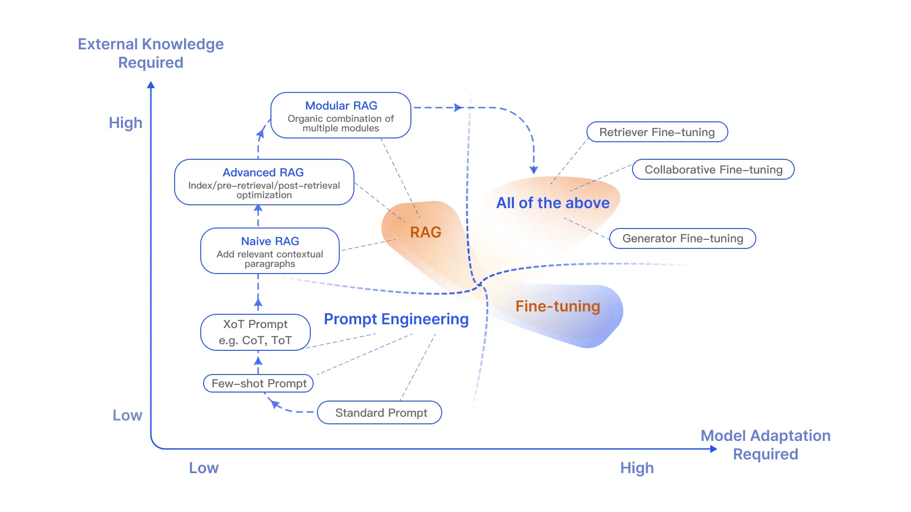

# 用于大型语言模型的检索增强生成：综述

> [!TIP] 原文信息
> 文本翻译自 [Retrieval-Augmented Generation for Large Language Models: A Survey](https://arxiv.org/abs/2312.10997)，第 4 版，可直接阅读最新版本的 [PDF 原文](https://arxiv.org/pdf/2312.10997) 了解最新信息。

Yunfan Gao^1, Yun Xiong^2, Xinyu Gao^2, Kangxiang Jia^2, Jinliu Pan^2, Yuxi Bi^3, Yi Dai^1, Jiawei Sun^1, Qianyu Guo^4, Meng Wang^3 and Haofen Wang^1,3*

1. 同济大学上海智能自主系统研究院
2. 复旦大学计算机科学技术学院
3. 同济大学设计创新学院
4. 复旦大学计算机科学技术学院

\* 通讯作者。电子邮件 <haofen.wang@tongji.edu.cn>

## 摘要

大型语言模型（LLMs）展示了显著的能力，但面临幻觉、过时知识、不透明、不可追溯的推理过程等挑战。检索增强生成（RAG）作为一种有希望的解决方案，通过整合来自外部数据库的知识来提高模型的准确性和可信度，特别适用于知识密集型任务，并允许持续的知识更新和领域特定信息的整合。RAG 将 LLMs 的内在知识与庞大、动态的外部数据库仓库相结合，实现了协同效应。本综述论文详细考察了 RAG 范例的发展，包括朴素 RAG、高级 RAG 和模块化 RAG，对 RAG 框架的三个基本组成部分进行了细致的审查，包括检索、生成和增强技术。本文重点介绍了每个关键组成部分中嵌入的最新技术，深入理解 RAG 系统的进展。此外，本文介绍了评估 RAG 模型的指标和基准，以及最新的评估框架。最后，本文勾勒了未来研究的前景，包括识别挑战、多模态的拓展以及 RAG 基础设施和生态系统的进展[^1]。

## 1. 简介

大型语言模型（LLMs）如 GPT 系列[^gpt-3][^gpt-4]、LLama 系列[^llama]以及 Gemini[^gemini]等模型，在自然语言处理领域取得了显著的成功，在 SuperGLUE[^superglue]、MMLU[^mmlu]和 BIG-bench[^bigbench]等各种基准测试中展现出卓越的性能。尽管取得了这些进展，LLMs 在处理领域特定或高度专业化的查询时存在明显的局限性[^longtail]。一个常见问题是生成错误的信息，或者在查询超出模型的训练数据或需要最新信息时出现“幻觉”[^hallucination]。这些缺点突显了在实际生产环境中部署 LLMs 作为黑盒解决方案的不可行性，需要额外的保护措施。缓解这些限制的一种有希望的方法是检索增强生成（RAG），它将外部数据检索集成到生成过程中，从而增强模型提供准确和相关回答的能力。

RAG 是由 Lewis 等人于 2020 年中提出的[^RAG]，是 LLMs 领域内增强生成任务的范例。具体而言，RAG 包括一个初始的检索步骤，在此步骤中，LLMs 查询外部数据源以获取相关信息，然后再回答问题或生成文本。这个过程不仅为后续的生成阶段提供信息，而且确保响应基于检索到的证据，从而显著增强了输出的准确性和相关性。在推理阶段从知识库动态检索信息的能力使得 RAG 能够解决一些问题，如生成事实不准确的内容，通常称为“幻觉”。将 RAG 集成到 LLMs 中得到了快速的采用，并成为改进聊天机器人能力、使 LLMs 更适用于实际应用的关键技术。

RAG 的演进轨迹可分为四个独立的阶段，如图 1 所示。在 2017 年的开始阶段，与 Transformer 架构同期出现，主要推动力是通过预训练模型（PTM）吸收额外的知识来增强语言模型。这个时期，RAG 的基础工作主要集中在优化预训练方法上。

在这个初始阶段之后，经历了一个相对低迷的时期，在此期间，RAG 相关研究的进展较少。ChatGPT 的出现标志着 RAG 发展轨迹的一个关键时刻，推动 LLMs 进入前沿。社区的重点转向利用 LLMs 的能力来实现更高的可控性和应对不断变化的需求。因此，RAG 的大部分努力集中在推理方面，只有少数人致力于微调过程。随着 LLMs 能力的不断提升，特别是 GPT-4 的引入，RAG 技术的面貌发生了重大转变。重点转向了一种混合方法，将 RAG 和微调的优势结合起来，同时只有少数人继续关注优化预训练方法。

尽管 RAG 研究快速发展，但在该领域缺乏系统的整合和概括，这在理解 RAG 进展的全面面貌方面存在挑战。本调查旨在概述整个 RAG 的发展过程，并涵盖 RAG 研究的当前和未来方向，通过对 LLMs 中检索增强的全面考察，提供技术原理、发展历史、内容以及特别是相关方法和应用的综合总结和组织。

因此，本文旨在全面总结和组织技术原理、发展历史、内容以及尤其是 LLMs 出现后的相关方法和应用，以及 RAG 的评估方法和应用场景。它旨在为读者和从业者提供对大型模型和 RAG 的全面和系统的理解，阐明检索增强的进展和关键技术，澄清各种技术的优点和限制以及适用的上下文，并预测未来的发展潜力。

我们的贡献如下：

- 我们对最先进的 RAG（检索增强生成）进行了全面系统的回顾，描述了它通过包括朴素 RAG、高级 RAG 和模块化 RAG 在内的范式的演变。这篇综述将 RAG 研究的更广泛范围置于 LLM（大型语言模型）的背景下。
- 我们确定并讨论了 RAG 过程中的核心技术，重点关注“检索”、“生成”和“增强”三个方面，并深入探讨它们之间的协同作用，阐明这些组成部分如何紧密合作形成一个有凝聚力和有效的 RAG 框架。
- 我们为 RAG 构建了一个全面的评估框架，概述了评估目标和指标。我们的比较分析从不同的角度阐明了 RAG 相对于微调的优势和劣势。此外，我们展望了 RAG 的未来发展方向，强调了应对当前挑战、扩展到多模态环境以及发展生态系统的潜在增强点。

论文的结构如下：第 2 节和第 3 节定义了 RAG 并详细介绍了其发展过程。第 4 节到第 6 节探讨了核心组成部分——检索、生成和增强，重点介绍了多种嵌入技术。第 7 节聚焦于 RAG 的评估系统。第 8 节比较了 RAG 与其他 LLM 优化方法，并提出了其演化的潜在方向。论文在第 9 节中总结。

## 2. 定义

RAG 的定义可以从其工作流程中总结出来。图 2 描述了典型的 RAG 应用工作流程。在这种情况下，用户向 ChatGPT 询问有关最近一次备受关注的事件（即 OpenAI 首席执行官的突然辞职和复职），这引起了广泛的公众讨论。作为最知名和广泛使用的 LLM，由于其预训练数据的限制，ChatGPT 缺乏对最近事件的了解。RAG 通过从外部知识库中检索最新的文档摘录来弥补这一差距。在这种情况下，它获取了与查询相关的一些新闻文章。然后，这些文章连同最初的问题被结合成一个丰富的提示，使 ChatGPT 能够综合一个知情的回应。这个例子说明了 RAG 的流程，展示了它利用实时信息检索增强模型回应的能力。

在技术上，RAG 已经通过各种创新方法进行了丰富，解决了诸如“什么要检索”、“何时检索”和“如何使用检索到的信息”等关键问题。就“什么要检索”而言，研究已经从简单的标记 [^kNN-LM] 和实体检索 [^ease] 进展到更复杂的结构，如块 [^ICRALM] 和知识图 [^sugre]，研究重点放在检索的粒度和数据结构化程度上。粗粒度提供更多的信息，但精度较低。检索结构化文本提供更多信息，但牺牲了效率。关于“何时检索”的问题已经导致了从单一 [^SKR][^Replug] 到自适应 [^Flare][^RAVEN] 和多重检索 [^Atlas] 方法的策略。高频率的检索提供更多信息，但效率较低。至于如何使用检索到的数据，集成技术已经在模型架构的各个层面中得到发展，包括输入 [^DSP]、中间 [^Retro] 和输出层 [^InterGen]。虽然“中间”和“输出层”更有效，但在需要训练和效率较低方面存在问题。

RAG 是通过整合外部知识库来增强 LLM 的一种范式。它采用协同方法，结合信息检索机制和上下文学习（ICL）来增强 LLM 的性能。在这个框架中，用户发起的查询通过搜索算法引发了相关信息的检索。然后将这些信息编织到 LLM 的提示中，为生成过程提供了额外的上下文。RAG 的关键优势在于它无需为特定任务重新训练 LLM。开发人员可以代之以附加外部知识库，丰富输入，从而提高模型的输出精度。由于其实用性高、入门门槛低，RAG 已经成为 LLM 系统中最受欢迎的架构之一，许多对话产品几乎完全建立在 RAG 之上。

RAG 工作流程包括三个关键步骤。首先，将语料库分成离散的块，然后利用编码器模型构建向量索引。其次，RAG 根据它们与查询和已索引块的向量相似性识别和检索这些块。最后，模型根据从检索到的块中获取的上下文信息合成响应。这些步骤构成了 RAG 过程的基本框架，支撑着其信息检索和上下文感知生成能力。接下来，我们将介绍 RAG 研究框架。

## 3. RAG 框架

RGA，检索增强生成（Retrieval-Augmented Generation），是一个持续发展的研究范式，本节主要描述其进展。我们将其分为三种类型：Naive RAG（朴素 RAG），Advanced RAG（高级 RAG）和 Modular RAG（模块化 RAG）。虽然 RAG 在成本效益和性能方面超越了原生 LLM，但它们也存在一些局限性。高级 RAG 和模块化 RAG 的发展是对朴素 RAG 中特定缺点的回应。

### 3.1 朴素 RAG

朴素 RAG 研究范式代表了最早的方法论，在广泛采用 ChatGPT 之后很快获得了重视。朴素 RAG 遵循传统的过程，包括索引、检索和生成。它也被称为“检索 - 阅读”框架[^RRR]。

#### 索引

索引过程是数据准备的关键初始步骤，离线进行，包括多个阶段。它从数据索引开始，对原始数据进行清洗和提取，将 PDF、HTML、Word 和 Markdown 等各种文件格式转换为标准化的纯文本。为了适应语言模型的上下文限制，将这些文本划分为更小、更易管理的块，这个过程称为分块。然后，通过嵌入模型将这些块转换为向量表示，选择嵌入模型是为了在推理效率和模型大小之间保持平衡。这有助于在检索阶段进行相似性比较。最后，创建一个索引，将这些文本块及其向量嵌入作为键值对存储，以实现高效和可扩展的搜索功能。

#### 检索

收到用户查询后，系统使用索引阶段中使用的编码模型将输入转码为向量表示。然后，计算查询向量与索引语料库中向量化块之间的相似性得分。系统优先选择和检索与查询最相似的前 $K$ 个块。然后，这些块被用作扩展上下文基础，以应对用户的请求。

#### 生成

将提出的查询和选定的文档合成为一个连贯的提示，然后由大型语言模型负责生成回应。模型回答问题的方法可能因任务特定标准而异，允许它根据内在的参数化知识进行回答，或者限制其回应范围在提供的文档中的信息之内。在进行持续对话的情况下，现有的对话历史可以合并到提示中，使模型能够有效地进行多轮对话交互。

#### 朴素 RAG 的缺点

朴素 RAG 在三个关键领域面临着重大挑战：“检索”，“生成”和“增强”。

检索质量面临着各种挑战，包括低精度，导致检索到的片段不匹配和可能出现幻觉或中断。还会出现低召回率，导致未能检索到所有相关片段，从而阻碍了语言模型生成全面回答的能力。过时的信息进一步加剧了这个问题，可能导致不准确的检索结果。

生成回应的质量存在幻觉的挑战，模型生成的答案与提供的上下文无关，同时还存在与模型输出中的无关上下文和潜在的毒性或偏见问题。

增强过程本身也面临着一些挑战，如如何有效地将检索到的片段的上下文与当前生成任务整合，可能导致输出不连贯或不一致。冗余和重复也是问题，特别是当多个检索到的片段包含相似信息时，在生成的回应中会出现重复内容。

确定多个检索到的片段与生成任务的重要性和相关性是另一个挑战，需要平衡每个片段的价值。此外，调和不同的写作风格和语气以确保输出的一致性也至关重要。

最后，存在一种生成模型过度依赖增强信息的风险，可能导致输出只是重申检索到的内容，而没有提供新的价值或综合信息。

### 3.2 高级 RAG

高级 RAG 通过有针对性的改进来解决朴素 RAG 的缺点。在检索质量方面，高级 RAG 实施了预检索和后检索策略。为了解决朴素 RAG 遇到的索引挑战，高级 RAG 使用滑动窗口、细粒度分割和元数据等技术来改进索引方法。它还引入了各种方法来优化检索过程 [^Illustrat]。

#### 预检索过程

*优化数据索引*：优化数据索引的目标是提高所索引内容的质量。这包括五个主要策略：提升数据粒度、优化索引结构、添加元数据、对齐优化和混合检索。

提升数据粒度旨在提高文本的标准化程度、一致性、事实准确性和丰富上下文，以提高 RAG 系统的性能。这包括删除无关信息、消除实体和术语的歧义、确认事实准确性、保持上下文和更新过时的文档。

优化索引结构涉及调整块的大小以捕捉相关上下文，跨多个索引路径进行查询，并利用图数据索引中节点之间的关系，整合相关上下文。

添加元数据信息涉及将引用的元数据（如日期和目的）整合到块中，以进行过滤，并将引用的章节和小节等元数据纳入索引以提高检索效率。

对齐优化通过引入“假设性问题” [^SANTA] 解决文档之间的对齐问题和差异。

#### 检索 {#retriever}

在检索阶段，主要目标是通过计算查询与块之间的相似度来确定适当的上下文。嵌入模型在这个过程中起着核心作用。在高级的检索增强生成（RAG）中，有优化嵌入模型的潜力。

*微调嵌入模型*：微调嵌入模型显著影响 RAG 系统中检索内容的相关性。这个过程包括定制嵌入模型，以增强特定领域上下文中的检索相关性，特别是处理不断演化或罕见术语的专业领域。BGE 嵌入模型[^2]，如由 BAAI 开发的 BGE-large-EN，就是一个可以进行微调以优化检索相关性的高性能嵌入模型。可以使用像 GPT-3.5-turbo 这样的语言模型来生成微调训练数据，这些数据是基于文档块提出问题，然后用作微调配对。

*动态嵌入*：根据单词的上下文适应单词的使用环境，而不是像静态嵌入那样为每个单词使用单一向量[^3][^DPR]。例如，在 BERT 等转换器模型中，同一个单词的嵌入可以根据周围的单词而有所不同。OpenAI 的 embeddings-ada-02 模型[^3]是一个基于 GPT 等 LLM 原理构建的复杂的动态嵌入模型，它捕捉到了上下文的理解。然而，它可能不像 GPT-4 这样的最新全尺寸语言模型对上下文敏感。

#### 检索后处理

从数据库中检索到有价值的上下文后，将其与查询合并作为 LLM 的输入，同时应对上下文窗口限制带来的挑战是至关重要的。一次性将所有相关文档呈现给 LLM 可能会超过上下文窗口的限制，引入噪声，妨碍对关键信息的关注。需要对检索到的内容进行额外的处理以解决这些问题。

*重排*：重新排序检索到的信息，将最相关的内容重新放置在提示的边缘是一种关键策略。这个概念已经在 LlamaIndex[^4]、LangChain[^5]和 HayStack[^LostInTheMiddleRanker]等框架中得到了实现。例如，Diversity Ranker[^6]根据文档的多样性进行重新排序，而 LostInTheMiddleRanker 则交替将最佳文档放置在上下文窗口的开头和结尾。此外，像 cohereAI rerank[^7]、bge-rerank[^7]和 LongLLMLingua[^jiang2023llmlingua]等方法重新计算相关文本与查询之间的语义相似度，解决了基于向量的模拟搜索的语义相似性解释的挑战。

*提示压缩*：研究表明，检索到的文档中的噪声会对 RAG 的性能产生不利影响。在后处理中，重点是压缩无关的上下文，突出关键段落，缩短整体上下文长度。Selective Context 和 LLMLingua[^Selective-Context][^LLMLingua]等方法利用小型语言模型计算提示的互信息或困惑度，估计元素的重要性。Recomp[^RECOMP]通过在不同粒度上训练压缩器来解决这个问题，而 Long Context[^xu2023retrieval]和"Walking in the Memory Maze"[^chen2023walking]则设计了摘要技术，以增强 LLM 对关键信息的感知，特别是在处理广泛上下文时。

### 3.3 模块化 RAG

模块化 RAG 结构与传统的朴素 RAG 框架有所不同，提供了更大的灵活性和多样性。它集成了各种方法来增强功能模块，例如加入了一个相似性检索模块和应用了细调整方法来改进检索器 [^RA-DIT]。重构的 RAG 模块 [^GenRead] 和迭代方法，例如 [^ITER-RETGEN]，已经被开发出来解决特定问题。模块化 RAG 范式在 RAG 领域越来越成为常态，可以在多个模块之间进行序列化流程或端到端训练。图 展示了三种 RAG 范式的比较。然而，模块化 RAG 并不是独立存在的。高级 RAG 是模块化 RAG 的一种特殊形式，而朴素 RAG 本身则是高级 RAG 的一种特例。这三种范式之间的关系是继承和发展的关系。

#### 新模块

*检索模块*：与朴素/高级 RAG 中的相似性检索相比，检索模块针对特定情况进行定制，并结合了对其他语料库的直接搜索。这种集成是通过 LLM 生成的代码、SQL 或 Cypher 等查询语言以及其他自定义工具来实现的。这些搜索的数据源可以包括搜索引擎、文本数据、表格数据和知识图谱 [^KnowledGPT]。

*记忆模块*：该模块利用 LLM 的记忆能力来指导检索。方法包括识别与当前输入最相似的记忆。Selfmem [^selfmem] 使用检索增强生成模型迭代地创建一个无界的记忆池，将“原始问题”和“双重问题”结合起来。通过使用一个利用自身输出来改进自身的检索增强生成模型，文本在推理过程中更加与数据分布一致。因此，模型的自身输出被用来替代训练数据 [^wang2022training]。

*融合*：RAG-Fusion [^fusion] 通过多查询方法扩展用户查询，以增强传统搜索系统并解决其局限性。该方法使用 LLM 将用户查询扩展为多个不同的视角。这种方法不仅捕捉用户明确寻求的信息，还揭示更深层次的转变性知识。融合过程包括对原始查询和扩展查询进行并行向量搜索，智能重新排序以优化结果，以及将最佳结果与新查询配对。这种复杂的方法确保搜索结果与用户的明确和隐含意图密切相关，从而实现更有见地和相关的信息发现。

*路由*：RAG 系统的检索过程利用不同领域、语言和格式的多样化来源，可以根据情况进行交替或合并 [^CREA-ICL]。查询路由决定对用户查询的后续操作，选项包括总结、搜索特定数据库或将不同路径合并为单个响应。查询路由还选择适合查询的数据存储，这可能包括各种来源，如向量存储、图数据库、关系数据库或索引的层次结构，例如，用于多文档存储的摘要索引和文档块向量索引。查询路由的决策是预定义的，并通过 LLM 调用执行，将查询指向选择的索引。

*预测*：它解决了检索内容中冗余和噪声的常见问题。该模块不直接从数据源检索，而是利用 LLM 生成所需的上下文 [^GenRead]。与直接检索获得的内容相比，LLM 生成的内容更有可能包含相关信息。

*任务适配器*：该模块专注于将 RAG 适应各种下游任务。UPRISE 自动从预先构建的数据池中检索用于零样本任务输入的提示，从而增强了任务和模型之间的通用性 [^UPRISE]。与此同时，PROMPTAGATOR [^PROMPTAGATOR] 将 LLM 用作少样本查询生成器，并基于生成的数据创建特定任务的检索器。通过利用 LLM 的泛化能力，它能够以最少的示例开发特定任务的端到端检索器。

#### 新模式

模块化 RAG 的组织结构非常灵活，可以根据特定的问题背景替换或重新排列模块。

朴素 RAG 和高级 RAG 都可以视为由一些固定模块组成。如图 3 所示，朴素 RAG 主要由“Retrieve（检索）”和“Read（阅读）”模块组成。Advanced RAG 的典型模式在朴素 RAG 的基础上添加了“Rewrite（重写）”和“Rerank（重排序）”模块。然而，总体上，模块化 RAG 具有更大的多样性和灵活性。

当前的研究主要探索两种组织范式。第一种是添加或替换模块，第二种是调整模块之间的组织流程。这种灵活性使得能够根据需要有效地处理各种任务的 RAG 过程。

*添加或替换模块*：引入或替换模块的策略涉及保持检索 - 阅读过程的核心结构，同时整合其他模块以增强特定功能。RRR 模型 [^RRR] 引入了重写 - 检索 - 阅读过程，利用 LLM 性能作为重写模块的强化学习激励，从而使重写器能够微调检索查询，从而提高阅读器的下游任务性能。

类似地，可以在像生成-读取（Generate-Read）[^GenRead] 这样的方法中选择性地交换模块，其中 LLM 的生成模块取代了检索模块。检索-读取（Recite-Read）方法 [^RECITE] 将外部检索转换为从模型权重进行检索，要求 LLM 最初记忆任务特定信息，然后产生能够处理知识密集型自然语言处理任务的输出。

*调整模块之间的流程*：在模块流程调整领域，重点是增强语言模型和检索模型之间的交互作用。DSP [^DSP] 引入了 Demonstrate-Search-Predict 框架，将上下文学习系统视为显式程序而不是最终任务提示，从而更有效地处理知识密集型任务。ITER-RETGEN [^ITER-RETGEN] 方法利用生成的内容引导检索，在 Retrieve-Read-Retrieve-Read 流程中迭代地实现了“检索增强生成”和“生成增强检索”。这种方法展示了一种创新的利用一个模块的输出来提高另一个模块功能的方式。

#### 优化 RAG 流程

检索过程的优化旨在提高 RAG 系统中的效率和信息质量。当前的研究重点包括整合多样化的搜索技术、优化检索步骤、引入认知回溯、实现多功能查询策略以及利用嵌入相似性。这些努力共同致力于在 RAG 系统中实现检索效率和上下文信息深度之间的平衡。

*混合搜索探索*：RAG 系统通过智能地整合各种技术，包括基于关键词的搜索、语义搜索和向量搜索，来优化其性能。这种方法利用每种方法的独特优势，以适应多样化的查询类型和信息需求，确保高度相关和上下文丰富的信息的一致检索。混合搜索的使用可以作为检索策略的强大补充，从而提高 RAG 流程的整体功效。

*递归检索和查询引擎*. 递归检索涉及在初始检索阶段获取较小的块以捕捉关键的语义含义。随后，在流程的后期阶段向 LLM 提供包含更多上下文信息的较大块。这种两步检索方法有助于在效率和提供上下文丰富响应之间取得平衡。

*StepBack-prompt*：方法鼓励 LLM 远离具体实例，从更广泛的概念和原理进行推理 [^StepBack-prompt]。实验结果表明，在使用向后提示时，各种具有挑战性的基于推理的任务的性能显著提高，突出了它们对 RAG 流程的自然适应性。这些增强检索的步骤可以应用于产生对向后提示的响应以及最终的问答过程。

*子查询*：根据情况，可以采用各种查询策略，例如使用由 LlamaIndex 等框架提供的查询引擎，利用树查询、利用向量查询或执行简单的顺序查询块。

*假设性文档嵌入*：HyDE 的操作基于生成的答案在嵌入空间中可能更接近于直接查询。使用 LLM，HyDE 根据查询创建一个假设性文档（答案），将该文档嵌入，并使用结果嵌入来检索与假设文档类似的真实文档。与基于查询的嵌入相似性不同，这种方法侧重于从一个答案到另一个答案的嵌入相似性 [^HyDE]。然而，它可能无法始终产生理想的结果，特别是当语言模型对主题不熟悉时，可能导致更多的错误实例。

## 4. 检索

在 RGA（检索增强生成）的背景下，高效地从数据源中检索相关文档至关重要。然而，创建一个熟练的检索器面临着重大挑战。本节将探讨三个基本问题：1）如何实现准确的语义表示？2）有哪些方法可以对查询和文档的语义空间进行对齐？3）如何使检索器的输出与大型语言模型的偏好保持一致？

### 4.1 增强语义表示

在 RGA 中，语义空间是至关重要的，因为它涉及查询和文档的多维映射。这个语义空间中的检索准确性对 RGA 的结果有着重要影响。本节将介绍两种构建准确语义空间的方法。

#### 块优化

在处理外部文档时，初始步骤涉及将它们分解为较小的块，以提取细粒度特征，然后嵌入以表示其语义。然而，嵌入过大或过小的文本块可能导致次优的结果。因此，确定语料库中文档的最佳块大小对于确保检索结果的准确性和相关性至关重要。

选择适当的分块策略需要仔细考虑几个重要因素，例如索引内容的性质、嵌入模型及其最佳块大小、用户查询的预期长度和复杂性，以及特定应用对检索结果的利用方式。例如，选择分块模型应基于内容的长度——无论是较长还是较短。此外，不同的嵌入模型在不同的块大小下表现出不同的性能特征。例如，sentence-transformer 在单个句子上表现更好，而 text-embedding-ada-002 在包含 256 或 512 个标记的块上表现出色。

此外，用户输入问题的长度和复杂性，以及应用程序的特定需求（例如语义搜索或问答）会影响分块策略的选择。这个选择可以直接受到所选 LLM 的标记限制的影响，需要调整块大小。实际上，获得精确的查询结果涉及灵活应用不同的分块策略。并不存在一个适用于所有情况的“最佳”策略，只有在特定环境下最合适的策略。

当前 RGA 研究探索了各种块优化技术，旨在提高检索效率和准确性。其中一种方法涉及使用滑动窗口技术，通过合并多个检索过程中的全局相关信息，实现分层检索。另一种策略称为“small2big”方法，在初始搜索阶段使用较小的文本块，然后为语言模型提供更大的相关文本块进行处理。

抽象嵌入技术基于文档摘要（或概述）进行前 K 个检索，提供对整个文档上下文的全面理解。此外，元数据过滤技术利用文档元数据增强过滤过程。一种创新的方法是图索引技术，将实体和关系转化为节点和连接，显著提高相关性，特别是在多跳问题的背景下。

这些多种方法的结合已经取得了显著的进展，提高了检索结果和 RGA 性能。

#### 微调嵌入模型

确定合适的块大小后，下一个关键步骤是使用嵌入模型将这些块和查询嵌入到语义空间中。嵌入的效果对于模型表示语料库的能力至关重要。最近的研究引入了一些知名的嵌入模型，如 AngIE、Voyage、BGE 等。这些模型在广泛的语料库上进行了预训练。然而，当应用于专业领域时，它们准确捕捉领域特定信息的能力可能有限。

此外，针对任务进行特定领域的嵌入模型微调是确保模型理解用户查询相关内容的关键。没有进行微调的模型可能无法充分满足特定任务的要求。因此，微调嵌入模型对于下游应用非常重要。嵌入微调方法主要有两种主要范式。

*领域知识微调*：为了确保嵌入模型准确捕捉领域特定信息，必须利用领域特定的数据集进行微调。这个过程与标准的语言模型微调不同，主要在于所涉及的数据集的性质。通常，用于嵌入模型微调的数据集包含三个主要元素：查询、语料库和相关文档。模型使用这些查询在语料库中识别相关文档。然后根据模型检索这些查询的相关文档的能力来评估模型的效果。数据集的构建、模型的微调和评估阶段都存在不同的挑战。LlamaIndex 引入了一套关键的类和函数，旨在增强嵌入模型微调工作流程，从而简化这些复杂的过程。通过精心策划充满领域知识的语料库并利用所提供的方法，可以熟练地微调嵌入模型，使其与目标领域的特定要求密切匹配。

*下游任务的微调*：微调嵌入模型以改善模型性能是提高模型性能的关键步骤。在利用 RAG 进行这些任务的领域中，出现了一些创新的方法，通过利用 LLM 的能力来微调嵌入模型。例如，PROMPTAGATOR 利用 LLM 作为 few-shot 查询生成器，创建了特定任务的检索器，解决了有限数据领域中监督微调的挑战。另一种方法是 LLM-Embedder，它利用 LLM 为多个下游任务的数据生成奖励信号。检索器通过两种类型的监督信号进行微调：数据集的硬标签和 LLM 的软奖励。这种双重信号方法促进了更有效的微调过程，使嵌入模型更适应各种下游应用。

尽管这些方法通过整合领域知识和任务特定微调来提高语义表示，但检索器可能并不总是与某些 LLM 具有最佳的兼容性。为了解决这个问题，一些研究人员探索了使用 LLM 的反馈直接监督微调过程。这种直接监督旨在更紧密地将检索器与 LLM 对齐，从而改善下游任务的性能。关于这个主题的更全面讨论见 ???。

### 4.2 查询和文档的对齐

在 RAG 应用中，检索器可能使用单个嵌入模型对查询和文档进行编码，也可以针对每个部分使用单独的模型。此外，用户的原始查询可能存在措辞不准确和缺乏语义信息的问题。因此，将用户查询的语义空间与文档的语义空间对齐是至关重要的。本节介绍了两种实现这种对齐的基本技术。

检索增强生成（RGA, Retrieval-Augmented Generation）是自然语言处理领域中用于对齐查询和文档语义的基本方法。Query2Doc 和 ITER-RETGEN 等方法利用 LLM（语言模型）通过将原始查询与额外的指导信息结合起来创建一个伪文档[^Query2Doc][^ITER-RETGEN]。HyDE 利用文本线索构建查询向量，生成一个“假设”文档，捕获关键模式[^HyDE]。RRR 引入了一个反转传统检索和阅读顺序的框架，重点是查询重写[^RRR]。STEP-BACKPROMPTING 使 LLM 能够基于高层概念进行抽象推理和检索[^StepBack-prompt]。此外，多查询检索方法利用 LLM 同时生成和执行多个搜索查询，有利于解决具有多个子问题的复杂问题。

#### 嵌入转换

除了查询重写等宏观策略外，还存在专门设计用于嵌入转换的更细粒度技术。LlamaIndex[^LlamaIndexTalk]通过引入一个适配器模块，在查询编码器之后进行集成，展示了这一点。该适配器有助于微调，从而优化查询嵌入的表示，将其映射到更贴近预期任务的潜在空间中。

通过 SANTA[^SANTA]解决了将查询与结构化外部文档对齐的挑战，特别是在处理结构化和非结构化数据之间的不一致性时。它通过两种预训练策略增强了检索器对结构化信息的敏感性：首先，利用结构化和非结构化数据之间的内在对齐关系，通过结构感知的预训练方案指导对比学习；其次，通过实施掩码实体预测。后者利用以实体为中心的掩码策略，鼓励语言模型预测和填充被掩码的实体，从而促进对结构化数据的更深入理解。

通过 SANTA[^SANTA]解决了将查询与结构化外部文档对齐的问题，特别是在处理结构化和非结构化数据之间的差异时。该方法通过两种预训练策略改善了检索器识别结构化信息的能力：首先，利用结构化和非结构化数据之间的内在对齐关系指导结构感知预训练方案中的对比学习；其次，采用掩码实体预测。后者使用以实体为中心的掩码策略，提示语言模型预测和填充被掩码的实体，从而促进对结构化数据的更深入理解。

### 4.3 检索器和 LLM 的对齐 {#subsec:align_retriellm}

在 RAG（检索增强生成）流程中，通过各种技术提高检索命中率可能并不一定改善最终结果，因为检索到的文档可能与 LLM 的特定需求不一致。因此，本节介绍了两种旨在将检索器的输出与 LLM 的偏好对齐的方法。

#### 微调检索器

一些研究利用 LLM 的反馈信号来改进检索模型。例如，AAR[^AAR]通过使用编码器 - 解码器架构，通过 FiD 交叉注意力分数识别 LLM 偏好的文档，为预训练的检索器引入了监督信号。随后，检索器通过硬负采样和标准的交叉熵损失进行微调。最终，经过改进的检索器可以直接应用于提升未见目标 LLM 的性能，从而改善目标任务的表现。此外，有人提出 LLM 可能更喜欢关注可读性而不是信息丰富的文档。

REPLUG[^Replug]利用检索器和 LLM 计算检索文档的概率分布，然后通过计算 KL 散度进行有监督训练。这种简单而有效的训练方法通过使用 LLM 作为监督信号来提高检索模型的性能，消除了特定交叉注意机制的需要。

UPRISE [^UPRISE] 还使用冻结的 LLM 来微调提示检索器。LLM 和检索器都以提示 - 输入对作为输入，并利用 LLM 提供的分数来监督检索器的训练，有效地将 LLM 视为数据集标签。此外，Atlas [^Atlas] 提出了四种监督微调嵌入模型的方法：

- *注意力蒸馏*：这种方法在输出过程中使用 LLM 生成的交叉注意力分数来蒸馏模型的知识。

- *EMDR2*：通过使用期望最大化算法，该方法将检索到的文档作为潜在变量来训练模型。

- *困惑度蒸馏*：直接使用生成的标记的困惑度作为指标来训练模型。

- *LOOP*：该方法基于文档删除对 LLM 预测的影响提出了一种新的损失函数，为特定任务提供了一种高效的训练策略，以更好地适应模型。

这些方法旨在改善检索器和 LLM 之间的协同作用，提高检索性能并更准确地回答用户的查询。

#### 适配器

微调模型可能会面临挑战，例如通过 API 集成功能或解决由于有限的本地计算资源而产生的限制。因此，一些方法选择引入外部适配器以帮助对齐。

PRCA 通过上下文提取阶段和奖励驱动阶段训练适配器。然后使用基于令牌的自回归策略对检索器的输出进行优化 [^PRCA]。令牌过滤方法利用交叉注意力分数高效过滤令牌，只选择最高评分的输入令牌 [^TokenFiltering]。RECOMP 为摘要生成引入了抽取和生成式压缩器。这些压缩器可以选择相关句子或综合文档信息，创建适合多文档查询的摘要 [^RECOMP]。

此外，PKG 通过指令微调引入了一种将知识集成到白盒模型中的创新方法 [^PKG]。在这种方法中，检索器模块直接替换为根据查询生成相关文档。这种方法有助于解决微调过程中遇到的困难，并提高模型性能。

## 5. 生成器

RAG 的关键组成部分是其生成器，负责将检索到的信息转换为连贯和流畅的文本。与传统的语言模型不同，RAG 的生成器通过合并检索到的数据提高了准确性和相关性。在 RAG 中，生成器的输入不仅包括典型的上下文信息，还包括通过检索器获得的相关文本片段。这种全面的输入使生成器能够深入了解问题的背景，从而产生更具信息量和相关性的响应。

此外，生成器受检索到的文本的指导，以确保生成内容与所获信息之间的一致性。多样化的输入数据导致在生成阶段进行有针对性的努力，所有这些努力都旨在优化大型模型对源自查询和文档的数据进行的调整。在接下来的小节中，我们将通过深入探讨后检索处理和微调的方面，来探讨生成器的引入。

### 5.1 使用冻结 LLM 进行后检索

在不可调整的 LLM 领域，许多研究依赖于像 GPT-4 [^gpt-4] 这样的老牌模型来利用它们丰富的内部知识，系统地合成来自各种文档的检索信息。然而，这些大模型存在一些挑战，包括上下文长度的限制和对冗余信息的敏感性。为了解决这些问题，某些研究努力将焦点转向后检索处理。

后检索处理包括对检索器从大型文档数据库中检索到的相关信息进行处理、过滤或优化。其主要目标是提高检索结果的质量，使其更符合用户需求或后续任务。它可以被视为对检索阶段获取的文档的再处理。后检索处理中常见的操作通常包括信息压缩和结果重新排序。

#### 信息压缩

检索器擅长从庞大的知识库中检索相关信息，但管理检索文档中的大量信息是一项挑战。持续的研究旨在扩展大型语言模型的上下文长度，以解决这个问题。然而，当前的大型模型仍然在处理上下文限制方面存在困难。因此，在某些情况下，压缩信息变得必要。信息压缩在减少噪声、解决上下文长度限制和增强生成效果方面具有重要意义。

PRCA 通过训练一种信息提取器来解决这个问题。在上下文提取阶段，当提供输入文本 $S_{input}$ 时，它能够生成一个表示从输入文档中提取的简化上下文的输出序列 $C_{extracted}$。训练过程旨在最小化 $C_{extracted}$ 与实际上下文 $C_{truth}$ 之间的差异。

类似地，RECOMP 通过使用对比学习训练信息压缩器采取了类似的方法。每个训练数据点包括一个正样本和五个负样本，编码器在整个过程中都通过对比损失进行训练。

另一项研究采用了不同的方法，旨在减少文档数量以提高模型答案的准确性。在所提出的“过滤器 - 重排器”(Filter Ranker) 范式研究中 [^filter-ranker]，他们将 LLM 和小语言模型 (SLM) 的优势相结合。在这种范式中，SLM 作为过滤器，而 LLM 作为重新排序的代理。研究表明，指导 LLM 对由 SLM 识别的具有挑战性的样本进行重新排列会显著改善各种信息提取 (IE, Information Extraction) 任务的结果。

#### 结果重排序

重排序模型在优化从检索器中检索到的文档集方面至关重要。当引入额外上下文时，语言模型往往面临性能下降，而重新排序可以有效解决这个问题。核心概念涉及重新排列文档记录，以优先考虑最相关的项目，从而限制文档总数。这不仅解决了检索过程中上下文窗口扩展的挑战，还增强了检索效率和响应速度。

重排序模型在信息检索过程中扮演双重角色，既是优化器又是精炼器。它为后续语言模型处理提供更有效和准确的输入[^QLM]。

上下文压缩被纳入重新排序过程中，以提供更精确的检索信息。这种方法包括减少单个文档的内容并过滤整个文档，最终目标是在搜索结果中呈现最相关的信息，实现对相关内容更集中和准确的显示。

### 5.2 为 RAG 进行微调 LLM

优化 RAG 模型中的生成器是其架构的关键方面。生成器的作用是接收检索到的信息并生成相关文本，形成模型的最终输出。生成器的优化旨在确保生成的文本既自然又有效地利用检索到的文档，以更好地满足用户的查询需求。

在标准 LLM 生成任务中，输入通常包括一个查询。RAG 突出之处在于不仅整合了一个查询，还将检索到的各种文档（结构化/非结构化）由检索器引入输入。这种额外的信息可以显着影响模型的理解，特别对于较小的模型而言。在这种情况下，对模型进行微调以适应既有查询又有检索到的文档的输入变得至关重要。在将输入提供给经过微调的模型之前，通常需要对检索器检索到的文档进行后检索处理。需要注意的是，RAG 中生成器的微调方法与 LLM 一般的微调方法一致。接下来，我们将简要描述涉及数据（格式化/非格式化）和优化函数的一些代表性作品。

#### 一般优化流程

作为一般优化流程的一部分，训练数据通常包括输入 - 输出对，旨在训练模型以在给定输入 $x$ 的情况下生成输出 $y$。在 Self-Mem 的工作中[^selfmem]，采用了传统的训练过程，给定输入 $x$ 后，检索相关文档 $z$（在论文中选择 Top-1），并在整合（$x$，$z$）后，模型生成输出 $y$。该论文利用了两种常见的微调范式，即 Joint-Encoder 和 Dual-Encoder[^REALM][^joint-encoder-2][^RAG][^dual-encoder-1][^dual-encoder-2][^dual-encoder-3]。

在 Joint-Encoder 范式中，使用基于编码器 - 解码器的标准模型。在这里，编码器首先对输入进行编码，解码器通过注意力机制将编码结果组合起来以自回归方式生成标记。另一方面，在 Dual-Encoder 范式中，系统设置两个独立的编码器，每个编码器分别对输入（查询、上下文）和文档进行编码。生成的输出经过解码器的双向交叉注意力处理。这两种架构均利用 Transformer[^Transformer] 作为基础模块，并通过负对数似然损失进行优化。

#### 利用对比学习

在为语言模型准备训练数据的阶段，通常会创建输入和输出的交互对。这种传统方法可能会导致“曝光偏差”，即模型只在个别、正确的输出示例上接受训练，从而限制了其接触各种可能输出的范围。这种限制可能会通过导致模型过度拟合于训练集中的特定示例，从而降低其在各种情境中的泛化能力，从而影响模型在真实世界中的表现。

为了减轻曝光偏差，SURGE [^sugre] 提出了使用图文对比学习。该方法包括一个对比学习目标，促使模型生成一系列合理且一致的响应，扩展到训练数据中遇到的实例范围之外。这种方法对于减少过度拟合和增强模型泛化能力至关重要。

对于涉及结构化数据的检索任务，SANTA 框架 [^SANTA] 实施了一个三部分的训练计划，有效地包含了结构和语义细微差别。初始阶段侧重于检索器，利用对比学习来精炼查询和文档嵌入。

随后，生成器的初步训练阶段利用对比学习来调整结构化数据与其非结构化文档描述之间的关系。在生成器训练的进一步阶段中，模型承认实体语义在表示学习中的关键作用，正如 [^SECQ][^ernie] 所强调的那样。这个过程从识别结构化数据中的实体开始，然后在生成器的输入数据中对这些实体施加掩码，为模型预测和预测这些被掩码元素铺平道路。

训练计划继续进行，模型学习通过利用上下文信息来重建被掩码的实体。这个练习培养了模型对文本数据结构语义的理解，促进了结构化数据中相关实体的对齐。最终优化目标是训练语言模型准确恢复被掩盖的跨度，从而丰富其对实体语义的理解 [^coreferential]。

## 6. RAG 中的增强

本节围绕三个关键方面展开：增强阶段，增强数据的来源以及增强过程。这些方面阐明了对于 RAG 发展至关重要的关键技术。RAG 核心组件的分类呈现在图 ??? 中。

### 6.1 增强阶段中的 RAG

RAG 作为一个知识密集型的工作，涵盖了语言模型训练的预训练、微调和推断阶段的各种技术方法。

#### 预训练阶段

在预训练阶段，研究人员已经调查了通过基于检索的策略来增强 PTMs 以进行开放域 QA 的方法。REALM 模型采用了一种结构化、可解释的知识嵌入方法，将预训练和微调作为一个在被掩码的语言模型（MLM）框架内进行检索然后预测工作流程 [^REALM]。

RETRO [^Retro] 利用检索增强进行大规模从零开始的预训练，减少模型参数的同时，在困惑度方面超过标准 GPT 模型。RETRO 通过一个额外的编码器区分于从外部知识库检索的实体特征的特征来构建，借鉴了 GPT 模型的基本结构。

Atlas [^Atlas] 也在 T5 架构 [^T5] 的预训练和微调阶段中加入了检索机制。它使用预训练的 T5 初始化编码器 - 解码器语言模型，并使用预训练的 Contriever 作为密集检索器，提高了复杂语言建模任务的效率。

此外，COG [^COG] 引入了一种新颖的文本生成方法，模拟从现有集合中复制文本片段。利用高效的向量搜索工具，COG 计算并索引文本片段的上下文相关的含义表示，表现出在问题回答和领域适应等领域中的卓越表现，与 RETRO 相比。

规模律的出现催化了模型参数的增长，将自回归模型推向主流。研究人员将 RAG 方法扩展到预训练的更大模型，RETRO++ 通过增加模型参数规模的趋势来展示此趋势，同时保持或增强性能 [^RETRO++]。

经验证据强调了在文本生成质量、事实准确性、毒性减少以及下游任务熟练度等方面的显著改进，特别是在开放领域问答等知识密集型应用中。这些结果表明，将检索机制整合到自回归语言模型的预训练中构成了一个有前途的途径，将复杂的检索技术与广泛的语言模型相结合，以产生更精确和高效的语言生成。

增强式预训练的好处包括一个强大的基础模型，在困惑度、文本生成质量和特定任务性能方面优于标准 GPT 模型，同时利用更少的参数。该方法特别擅长处理知识密集型任务，并通过在专门语料库上进行训练促进了领域特定模型的发展。

然而，这种方法面临的挑战包括对广泛的预训练数据集和资源的必要性，以及随着模型规模增加而降低的更新频率。尽管存在这些障碍，但该方法在模型韧性方面提供了显著优势。一旦训练完成，改进检索的模型可以独立于外部库运行，提高生成速度和运行效率。所识别的潜在收益使得这种方法成为人工智能和机器学习领域中持续调查和创新的引人注目的主题。

#### 微调阶段

RAG 和微调是增强语言模型的强大工具，将两者结合起来可以满足更具体的场景需求。一方面，微调允许检索具有独特风格的文档，实现更好的语义表达，以及调整查询和文档之间的差异。这确保了检索器的输出更加适合手头场景。另一方面，微调可以满足进行样式化和定向调整的生成需求。此外，微调还可以用于调整检索器和生成器，以实现更好的模型协同性。

微调检索器的主要目标是通过直接微调嵌入模型，使用语料库来改善语义表示的质量。通过反馈信号将检索器的能力与语言模型的偏好对齐，两者可以更好地协调。将检索器微调到特定的下游任务可以提高适应性[引用？]。引入任务不可知的微调旨在增强检索器在多任务场景中的多功能性。

微调生成器会产生更具风格化和定制化的输出。一方面，它允许对不同的输入数据格式进行专门的调整。例如，微调语言模型以适应知识图谱的结构、文本对的结构和其他特定结构。另一方面，通过构建指令数据集，可以要求语言模型生成特定格式的内容。例如，在自适应或迭代检索场景中，可以微调语言模型以生成有助于确定下一步操作时机的内容。

通过协同微调检索器和生成器，我们可以增强模型的泛化能力，并避免由单独训练它们导致的过拟合。然而，联合微调也会导致资源消耗增加。RA-DIT [^RA-DIT] 提出了一种轻量级的双指令调整框架，可以有效地为任何 LLMs 添加检索功能。增强检索指令微调更新 LLM，引导其更有效地利用检索到的信息并忽略干扰内容。

尽管微调具有优点，但也存在局限性，包括需要专门的数据集进行 RAG 微调以及需要大量计算资源。然而，这个阶段允许定制模型以满足特定需求和数据格式，可能减少资源使用量，同时仍能微调模型的输出样式。

总之，微调阶段对于将 RAG 模型适应特定任务至关重要，使检索器和生成器得以精细调整。这个阶段增强了模型的多功能性和适应性，尽管资源和数据集要求带来了挑战。因此，RAG 模型的战略微调是开发高效和有效的检索增强系统的关键组成部分。

#### 推理阶段

RAG 模型中的推理阶段至关重要，因为它涉及与 LLMs 的广泛集成。朴素 RAG 方法，也称为 Naive RAG，在这个阶段将检索内容纳入以引导生成过程。

为了克服朴素 RAG 的局限性，先进的技术在推理过程中引入更具有上下文丰富性的信息。DSP 框架 [^DSP] 利用自然语言文本之间的复杂交流，丰富上下文，从而提高生成结果。PKG 方法 [^PKG] 配备了一个知识引导模块，使 LLMs 能够检索相关信息而无需修改 LM 参数，从而实现更复杂的任务执行。CREA-ICL [^CREA-ICL] 采用同步检索跨语言知识的方法增强上下文，而 RECITE [^RECITE] 通过直接从 LLMs 中抽样段落来生成上下文。

在推理阶段对 RAG 过程的进一步完善在需求多步推理的任务中得以体现。ITRG [^ITRG] 迭代检索信息以识别正确的推理路径，从而提高任务适应性。ITER-RETGEN [^ITER-RETGEN] 遵循迭代策略，将检索和生成合并为一个循环过程，交替进行“检索增强生成”和“生成增强检索”。对于非知识密集型（NKI）任务，PGRA [^PGRA] 提出了一个两阶段框架，首先是一个面向任务的检索器，然后是一个以提示为指导的重新排列器，以选择和优先考虑证据。相反，IRCOT [^IRCoT] 将 RAG 与思维链（CoT）方法结合，交替使用 CoT 引导检索和检索信息的 CoT 过程，显著提高了 GPT-3 在各种问答任务中的性能。

总而言之，这些推理阶段的增强提供了轻量级、经济有效的替代方案，利用了预训练模型的能力，而无需进一步培训。主要优点是保持静态 LLM 参数，同时为满足特定任务需求提供相关上下文信息。然而，这种方法并非没有局限性，它需要仔细的数据处理和优化，并受限于基础模型的固有能力。为有效解决多样的任务需求，这种方法通常与过程优化技术配对，如逐步推理、迭代检索和自适应检索策略。

### 6.2 增强信息源

RAG 模型的有效性在很大程度上取决于用于增强的数据源的选择。不同水平的知识和维度需要不同的处理技术。它们被分类为非结构化数据、结构化数据和由 LLMs 生成的内容。具有不同增强方面的代表性 RAG 研究技术树如下图所示 ???。树叶以三种不同色彩呈现，表示使用各种类型数据的增强：非结构化数据、结构化数据和由 LLMs 生成的内容。该图清楚地显示，最初增强主要通过非结构化数据（如纯文本）实现。随后，这种方法扩展到利用结构化数据（例如知识图）以进一步改善。最近，有一种增长趋势，即利用由 LLMs 生成的内容进行检索和增强目的。

#### 使用非结构化数据进行增强

非结构化文本是从语料库中获取的，例如用于精细调整大型模型的提示数据[^UPRISE]和跨语言数据[^CREA-ICL]。检索单元从标记（例如 kNN-LM[^kNN-LM]）到短语（例如 NPM，COG[^NPM][^COG]）和文档段落不等，精细的粒度提供了准确性，但增加了检索的复杂性。

FLARE[^Flare]引入了一种主动检索方法，由 LM 生成低概率单词触发。它为文档检索创建一个临时句子，然后用检索到的上下文重新生成句子，以预测后续句子。RETRO 使用前一块来检索块水平上的最近邻居，结合上一块的上下文，引导下一块的生成。为了保留因果关系，下一块 $C_i$ 的生成仅利用上一块的最近邻居 $N(C_{i-1})$ 而非 $N(C_i)$。

#### 使用结构化数据进行增强

结构化数据，例如知识图谱（KGs），提供高质量上下文并减轻模型的幻觉。RET-LLMs[^RET-LLM]为将来参考从过去对话中构建知识图谱记忆。SUGRE[^sugre]利用图神经网络（GNNs）对相关 KG 子图进行编码，通过多模态对比学习确保检索到的事实与生成的文本之间的一致性。KnowledGPT[^KnowledGPT]生成知识库搜索查询并在个性化数据库中存储知识，增强了 RAG 模型的知识丰富性和上下文性。

#### RAG 中的 LLMs 生成内容

针对 RAG 中外部辅助信息的局限性，一些研究专注于利用 LLMs 的内部知识。SKR[^SKR]将问题分类为已知或未知，有选择地应用检索增强。GenRead[^GenRead]用 LLM 生成器替换检索器，发现由于更好地与因果语言建模的预训练目标对齐，LLM 生成的上下文通常包含更准确的答案。Selfmem[^selfmem]通过用检索增强的生成器迭代地创建一个无限的内存池，使用内存选择器选择作为原始问题的双重问题的输出，从而增强生成模型自身。

这些方法强调了在 RAG 中利用创新数据源的广泛应用，力求提高模型性能和任务有效性。

### 6.3 增强过程

在 RAG 领域中，标准做法通常涉及单个检索步骤后跟随生成，这会导致低效。一个显著的问题，称为“中间迷失”现象，当单次检索产生多余内容时可能会削弱或矛盾于基本信息，从而降低生成质量。此外，这种单一检索通常对于需要多步推理的复杂问题是不够的，因为它提供了有限范围的信息[^irrelevantRobust]。

如图所示<!-- ? -->，为了避免这些挑战，当代研究提出了改进检索过程的方法：迭代检索、递归检索和自适应检索。迭代检索允许模型参与多次检索循环，增强获取信息的深度和相关性。递归检索过程是指将一个检索操作的结果用作后续检索的输入。尤其在处理复杂或多步查询时，有助于深入相关信息。递归检索通常用于需要逐渐接近最终答案的场景，如学术研究、法律案例分析或某些类型的数据挖掘任务。另一方面，自适应检索提供了一种动态调整机制，根据不同任务和情境的具体需求定制检索过程。

#### 迭代检索

在 RAG 模型中，迭代检索是一个过程，文档基于初始查询和迄今生成的文本重复收集，为 LLMs 提供更全面的知识库。通过多次检索迭代，这种方法已被证明通过提供通过多次检索迭代获得的额外上下文参考，增强了随后答案生成的鲁棒性。然而，它可能在语义上存在不连续性和无关信息的积累，因为它通常依赖于一系列 n 个标记，以标识生成文本和检索文档之间的边界。

为了应对特定数据情景，利用了递归检索和多跳检索技术。递归检索涉及使用结构化索引以层次化方式处理和检索数据，这可能包括在执行基于此摘要的检索之前总结文档的部分或大幅 PDF。随后，文档内的次要检索会细化搜索，体现了该过程的递归特性。相比之下，多跳检索旨在深入图结构化数据源，提取互相关联的信息。此外，一些方法将检索和生成步骤整合在一起。ITER-RETGEN 利用“检索增强生成”和“生成增强检索”并行运用的协同方法，用于需要重现特定信息的任务。该模型利用为解决输入任务所需的内容作为检索相关知识的上下文基础，进而促进在后续迭代中生成改进的响应。

#### 递归检索

递归检索通常用于信息检索和 NLP 中，以提高搜索结果的深度和相关性。该过程涉及根据先前搜索结果获得的结果迭代地完善搜索查询。递归检索旨在通过反馈循环逐渐收敛于最相关信息，从而提升搜索体验。IRCoT 使用思维链来指导检索过程，并根据获得的检索结果完善 CoT。ToC 创建一个澄清树，系统地优化查询中的模糊部分。它在用户的需求从一开始并不完全清晰或所寻信息非常专业或微妙的复杂搜索场景中尤其有用。该过程的递归性质允许持续学习和适应用户的需求，通常导致对搜索结果的满意度提高。

#### 自适应检索

自适应检索方法，如 Flare 和 Self-RAG，通过使 LLMs 主动确定检索的最佳时机和内容，从而增强了 RAG 框架，增强了所获取信息的效率和相关性。

这些方法是 LLM 广泛趋势的一部分，在其操作中使用主动判断，例如在模型代理中看到的 AutoGPT，Toolformer 和 Graph-Toolformer。

例如，Graph-Toolformer 将其检索过程分为不同步骤，LLMs 主动使用检索器，应用 Self-Ask 技术，并使用少量提示来启动搜索查询。这种主动立场使 LLMs 能够决定何时搜索必要信息，类似于代理如何利用工具。

WebGPT 整合了一个强化学习框架，用于训练 GPT-3 模型在文本生成过程中自主使用搜索引擎。它使用特殊标记来导航这个过程，促进动作，如搜索引擎查询、浏览结果和引用参考文献，从而通过使用外部搜索引擎扩展了 GPT-3 的能力。

Flare 通过监控生成过程的置信度来自动化时间检索，该生成过程的置信度由生成术语的概率指示。当概率低于一定阈值时，将激活检索系统来收集相关信息，从而优化检索周期。

Self-RAG 引入了“反射标记”，允许模型审视其输出。这些标记有两种类型：“检索”和“评论家”。模型自主决定何时激活检索，或者可以触发预定义的阈值。在检索过程中，生成器通过多段落进行片段级波束搜索，以获得最连贯的序列。评论家分数用于更新细分分数，灵活调整这些权重以在推断期间调整模型的行为。Self-RAG 的设计消除了对额外分类器或依赖自然语言推理（NLI）模型的需要，从而简化了何时参与检索机制的决策过程，并提高了模型在生成准确响应方面的自主判断能力。

LLM 优化由于其日益普及而受到重视。诸如提示工程、Fine-Tuning（FT）和 RAG 之类的技术具有各自的特点，在图中以图 ??? 的方式进行了视觉表示。虽然提示工程利用模型固有的能力，但优化 LLM 通常需要应用 RAG 和 FT 方法。在 RAG 和 FT 之间的选择应基于特定场景的要求和每种方法的内在特性。关于 RAG 和 FT 的详细比较见表 ???。

### 6.4 RAG vs 微调

RAG 就像给模型提供定制信息检索的教科书，非常适合特定查询。另一方面，FT 就像学生随着时间内化知识，更适合复制特定结构、样式或格式。FT 可以通过强化基础模型知识、调整输出和传授复杂指令来提高模型性能和效率。但是，它不适合集成新知识或快速迭代新的用例。

RAG 和 FT 这两种方法并不是互斥的，可以相互补充，增强模型在不同层面上的能力。在某些情况下，它们的联合使用可能会产生最佳性能。涉及 RAG 和 FT 的优化过程可能需要多次迭代才能实现令人满意的结果。

## 7. RAG 评估

在自然语言处理（NLP）领域中，RAG 的快速发展和日益普及已将 RAG 模型的评估推到了 LLMs 社区研究的前沿。这一评估的主要目标是理解和优化 RAG 模型在各种应用场景中的性能。

从历史上看，RAG 模型评估通常集中于它们在特定下游任务中的执行。这些评估使用适合当前任务的已建立的度量标准。例如，问答评估可能依赖于 EM 和 F1 得分[^InstructRetro][^Replug][^ITRG][^RRR]，而事实核实任务通常以准确性作为主要度量标准[^RAG][^Atlas][^ITER-RETGEN]。像 RALLE 这样的工具，专为 RAG 应用的自动评估而设计，同样基于这些特定任务的度量标准进行评估[^RALLE]。尽管如此，关于评估 RAG 模型独特特征的研究是明显不足的，只有少数相关研究。

下一部分将重点从特定任务评估方法和度量转移到基于它们独特属性的现有文献综合。这次探索涵盖了 RAG 评估的目标、这些模型被评估的方面以及可用于这种评估的基准和工具。目的是提供对 RAG 模型评估的全面概述，概述专门解决这些先进生成系统独特方面的方法。

### 7.1 评估目标

RAG 模型的评估主要围绕两个关键组件展开：检索和生成模块。这种分割确保了对所提供上下文的质量和生成的内容质量都进行了全面评估。

#### 检索质量

评估检索质量对于确定检索组件提供上下文的效果至关重要。从搜索引擎、推荐系统和信息检索系统领域的标准度量标准被用于测量 RAG 检索模块的性能。诸如命中率、MRR 和 NDCG 等指标通常用于此目的[^LlamaIndexTalk][^DeepSet-Blog]。

#### 生成质量

生成质量的评估围绕生成器从检索的上下文中综合出连贯和相关的答案的能力展开。这种评估可以根据内容的目标进行分类：未标记的内容和已标记的内容。对于未标记的内容，评估包括所生成答案的忠实度、相关性和无害性。相反，对于已标记的内容，重点是模型产生信息的准确性[^LlamaIndexTalk]。此外，检索和生成质量评估可以通过手动或自动评估方法进行[^LlamaIndexTalk][^COG][^Databricks-RAG]。

### 7.2 评估方面

RAG 模型的当代评估实践强调三项主要质量得分和四项基本能力，这些共同信息构成了对 RAG 模型的两个主要目标（检索和生成）的评估。

#### 质量得分

质量得分包括上下文相关性、答案忠实度和答案相关性。这些质量得分从不同角度评估了 RAG 模型在信息检索和生成过程中的效率[^RAGAS][^ARES][^OpenAI-DevDayTalk]。质量得分——上下文相关性、答案忠实度和答案相关性——通过信息检索和生成过程中的各个角度评估了 RAG 模型的效率[^RAGAS][^ARES][^OpenAI-DevDayTalk]。

*上下文相关性* 评估了检索到的上下文的精确性和特异性，确保相关性并最小化与无关内容相关的处理成本。

*答案忠实度* 确保生成的答案与检索到的上下文保持一致，避免矛盾。

*答案相关性* 要求生成的答案直接与提出的问题相关，有效地回答核心问题。

#### 所需能力

RAG 评估还涵盖了四种表明其适应性和效率的能力：噪声鲁棒性，负面拒绝，信息整合和对照鲁棒性 [^RGB][^RECALL]。这些能力对模型在各种挑战和复杂情景下的表现至关重要，影响着质量评分。

*噪声鲁棒性* 评估了模型处理噪声文档的能力，这些文档与问题相关，但缺乏实质性信息。

*负面拒绝* 评估了模型在检索到的文档不包含回答问题所需知识时的辨别力，以避免回答。

*信息整合* 评估了模型从多个文档中综合信息以回答复杂问题的能力。

*对照鲁棒性* 测试了模型识别和忽略文档中已知错误的能力，即使被告知可能存在错误信息。

上下文相关性和噪声鲁棒性对于评估检索质量很重要，而答案忠实度，答案相关性，负面拒绝，信息整合和对照鲁棒性对于评估生成质量也很重要。

每个评估方面的具体指标总结如下表 ???。至关重要的是要意识到这些指标是从相关工作中衍生出来的传统衡量标准，尚未代表成熟或标准化的 RAG 评估方面的方法。针对 RAG 模型特点量身定制的自定义指标尽管没有包含在其中，但在一些评估研究中也已开发。

### 7.3 评估基准和工具

本部分描述了 RAG 模型的评估框架，包括基准测试和自动评估工具。这些工具提供量化指标，不仅可以衡量 RAG 模型的表现，还可以增进对模型在各种评估方面的能力的理解。著名的基准测试如 RGB 和 RECALL[^RGB][^RECALL]专注于评估 RAG 模型的基本能力。与此同时，像 RAGAS[^RAGAS]，ARES[^ARES]和 TruLens[^8]这样的最新自动工具利用 LLMs 来裁定质量得分。这些工具和基准共同构成了一个稳健的框架，用于系统评估 RAG 模型，如表 ??? 所总结。

## 8. 未来展望

本部分探讨了 RAG 的三个未来展望：未来挑战，模态扩展和 RAG 生态系统。

### 8.1 RAG 的未来挑战

尽管 RAG 技术取得了相当大的进展，但仍然存在一些需要深入研究的挑战：

*上下文长度*：RAG 的效力受到大型语言模型（LLMs）上下文窗口大小的限制。在太短的窗口和太长的窗口之间平衡，以避免信息不足或信息稀释是至关重要的。随着不断努力将 LLMs 上下文窗口扩展到几乎无限的大小，RAG 适应这些变化的研究提出了一个重要问题。

*鲁棒性*：在检索过程中存在噪声或矛盾信息会对 RAG 的输出质量产生不利影响。这种情况被比喻为“错误信息比没有信息更糟糕”。提高 RAG 对此类对抗性或对照性输入的抵抗力正在获得研究动力，并已成为一个关键的绩效指标。

*混合方法（RAG+FT）*：将 RAG 与微调结合正在成为一种领先策略。确定 RAG 和微调的最佳整合方式，无论是顺序、交替还是通过端到端联合训练——以及如何利用参数化和非参数化优势是值得探索的领域 [^RA-DIT]。

*LLM 角色的扩展*：除了生成最终答案外，LLM 还被用于检索和评估 RAG 框架内的内容。识别进一步释放 LLM 在 RAG 系统中的潜力的方法是一个日益增长的研究方向。

*扩展规律*：虽然已经为 LLM 建立了扩展规律 [^kaplan2020scaling]，但它们对 RAG 的适用性尚不确定。最初的研究 [^RETRO++] 已经开始解决这个问题，然而参数数量在 RAG 模型中仍然落后于 LLM。存在逆向规模定律的可能性[^9]，即较小的模型胜过更大的模型，特别具有吸引力，值得进一步调查。

*可生产的 RAG 模型*：RAG 的实用性和与工程要求的一致性已经促成了 RAG 的采用。然而，增强检索效率，提高大型知识库中的文档召回率以及确保数据安全性——例如通过 LLM 防止文件源或元数据的意外泄露——这些都是尚待解决的关键工程挑战 [^retromaton]。

#### RAG 的模态扩展

RAG 已经超越了最初基于文本的问答框架，融合了多样化的模态数据。这种扩展催生了创新的多模态模型，跨越各个领域整合了 RAG 概念：

*图像*：RA-CM3 [^ramlm] 是一种同时检索和生成文本和图像的开创性多模态模型。BLIP-2 [^BLIP-2] 利用冻结的图像编码器与 LLM 一起进行有效的视觉语言预训练，实现了零 -shot 图像到文本的转换。"在写之前可视化"方法 [^VBR] 利用图像生成来引导 LM 的文本生成，在开放式文本生成任务中显示出潜力。

*音频和视频*：GSS 方法检索并拼接音频剪辑，将机器翻译数据转换为语音翻译数据 [^GSS]。UEOP 在端到端自动语音识别领域取得了显著进展，通过整合外部、离线策略实现了语音到文本的转换 [^UEOP]。另外，基于 KNN 的注意力融合利用音频嵌入和语义相关的文本嵌入优化了语音识别，从而加速了领域适应。Vid2Seq 利用专门的时间标记增强语言模型，促进事件边界的预测和文本描述的能力在统一输出序列内 [^Vid2Seq]。

*代码*：RBPS [^RBPS] 通过检索与开发人员目标一致的代码示例在小规模学习任务中表现出色，通过编码和频率分析。这种方法在测试断言生成和程序修复等任务中展示了有效性。对于结构化知识，CoK 方法 [^CoK] 首先从知识图中提取与输入查询相关的事实，然后将这些事实作为提示集成到输入中，在知识图问答任务中提高了性能。

### 8.2 RAG 的生态系统

#### 下游任务和评估

RAG 在丰富语言模型的能力方面表现出了相当大的潜力，能够处理复杂查询并通过利用广泛的知识库生成详细的响应。经验数据表明 RAG 在各种下游任务中表现出色，包括开放式问题回答和事实验证。整合 RAG 不仅增强了响应的精度和相关性，还增加了其多样性和深度。

RAG 的可扩展性和多领域适用性使得进一步调查变得必要，尤其在专业领域如医学、法律和教育等领域。在这些领域，与传统的精细调整方法相比，RAG 可能可以降低培训成本并增强性能，从而提高专业领域知识问题回答的效果。

同时，改进 RAG 的评估框架对于最大化其在不同任务中的功效和效用至关重要。这需要开发细致的指标和评估工具，可以衡量诸如上下文相关性、内容的创造力和非恶意性等方面。

此外，提高基于 RAG 的模型的可解释性仍然是一个关键目标。这将使用户能够理解模型生成的响应背后的推理过程，从而在使用 RAG 应用时促进信任和透明度。

#### 技术栈

RAG 生态系统的发展在很大程度上受到其技术栈的发展影响。关键工具如 LangChain 和 LLamaIndex 随着 ChatGPT 的出现迅速赢得了广泛的人气，提供了广泛的 RAG 相关 API，并在 LLM 领域变得不可或缺。

新兴的技术栈虽然不像 LangChain 和 LLamaIndex 那样功能丰富，但通过特色产品区别于众。例如，Flowise AI[^10] 优先采用低代码方法，使用户能够通过用户友好的拖放界面部署包括 RAG 在内的 AI 应用程序。其他技术如 HayStack、Meltano[^11] 和 Cohere Coral[^12] 也因其在该领域中独特的贡献而备受关注。

除了以人工智能为重点的提供商外，传统软件和云服务提供商也在扩大他们的产品范围，包括 RAG 中心化服务。Weaviate 的 Verba[^13] 专为个人助理应用程序设计，而亚马逊的 Kendra[^14] 提供智能企业搜索服务，允许用户通过内置连接器浏览各种内容库。随着 RAG 技术领域的发展，不同的专业化方向明显分道扬镳，如：

1. *定制化.* 调整 RAG 以满足特定要求。
2. *简化.* 使 RAG 更易于使用，从而降低初始学习曲线。
3. *专业化.* 精益求精，更有效地为生产环境服务。

RAG 模型和其技术栈的相互增长是显而易见的；技术进步不断为现有基础设施设立新标准。反过来，技术栈的增强推动了 RAG 能力的发展。RAG 工具包正在汇聚成为基础技术栈，奠定了高级企业应用程序的基础。然而，一个完全集成、全面的平台概念仍然在地平线上，需要进一步的创新和发展。

## 9. 结论

本文的摘要，如图 7 所示，突出了通过将语言模型的参数化知识与外部知识库的大量非参数化数据相结合，RAG 在增强 LLMs 能力方面取得的显著进展。我们的调查展示了 RAG 技术的发展以及它们对知识密集型任务的影响。我们的分析描绘了 RAG 框架内的三种发展范式：朴素、高级和模块化 RAG，每一种都比其前身具有渐进性增强。高级 RAG 范式通过整合复杂的架构元素，包括查询重写、块重新排序和提示摘要，超越了朴素方法。这些创新导致了一个更加细致和模块化的架构，增强了 LLMs 的性能和可解释性。RAG 与其他 AI 方法的技术整合，如微调和强化学习，进一步扩展了其能力。在内容检索方面，利用结构化和非结构化数据源的混合方法正成为一种趋势，提供了更丰富的检索流程。RAG 框架内的尖端研究正在探索新颖的概念，如从 LLMs 中进行自检索和信息检索的动态时机。

尽管 RAG 技术取得了进展，但在改善其稳健性和处理扩展上下文的能力方面仍有研究机会。RAG 的应用范围也在拓展到多模态领域，将其原则调整为解释和处理各种数据形式，如图像、视频和代码。这种拓展凸显了 RAG 对 AI 部署的重要实际意义，吸引了学术界和工业界的兴趣。RAG 生态系统的增长得到了支持性工具不断开发以及与 RAG 中心的 AI 应用日益增多的强调。然而，随着 RAG 的应用领域不断扩大，有必要完善评估方法学，以跟上其发展步伐。确保性能评估保持准确和代表性对于捕捉 RAG 对 AI 研究和发展社区的贡献至关重要。

## 参考文献

<!-- markdownlint-disable MD053 -->

[^1]: 资源可在 <https://github.com/Tongji-KGLLM/RAG-Survey> 获取

[^2]: <https://huggingface.co/BAAI/bge-large-en>

[^3]: <https://platform.openai.com/docs/guides/embeddings>

[^4]: <https://www.llamaindex.ai>

[^5]: <https://www.langchain.com/>

[^6]: <https://haystack.deepset.ai/blog/enhancing-rag-pipelines-in-haystack>

[^7]: <https://huggingface.co/BAAI/bge-reranker-large>

[^8]: <https://www.trulens.org/trulens_eval/core_concepts_rag_triad/>

[^9]: <https://github.com/inverse-scaling/prize>

[^10]: <https://flowiseai.com>

[^11]: <https://meltano.com>

[^12]: <https://cohere.com/coral>

[^13]: <https://github.com/weaviate/Verba>

[^14]: <https://aws.amazon.com/cn/kendra/>

[^teng2015regulation]: G. Teng and D. G. Schatz, “Regulation and evolution of the RAG recombinase,” *Advances in immunology*, vol. 128, pp. 1–39, 2015.

[^abelson-et-al:scheme]: H. Abelson, G. J. Sussman, and J. Sussman, *Structure and Interpretation of Computer Programs*. Cambridge, Massachusetts: MIT Press, 1985.

[^bgf:Lixto]: R. Baumgartner, G. Gottlob, and S. Flesca, “Visual Information Extraction with Lixto,” in *Proceedings of the 27th International Conference on Very Large Databases*, Sep. 2001, pp. 119–128.

[^brachman-schmolze:kl-one]: R. J. Brachman and J. G. Schmolze, “An overview of the KL-ONE knowledge representation system,” *Cognitive Science*, vol. 9, no. 2, pp. 171–216, 1985.

[^gottlob:nonmon]: G. Gottlob, “Complexity results for nonmonotonic logics,” *Journal of Logic and Computation*, vol. 2, no. 3, pp. 397–425, Jun. 1992.

[^Vid2Seq]: A. Yang *et al.*, “Vid2seq: Large-scale pretraining of a visual language model for dense video captioning,” in *Proceedings of the IEEE/CVF Conference on Computer Vision and Pattern Recognition*, 2023, pp. 10714–10726.

[^gls:hypertrees]: G. Gottlob, N. Leone, and F. Scarcello, “Hypertree Decompositions and Tractable Queries,” *Journal of Computer and System Sciences*, vol. 64, no. 3, pp. 579–627, May 2002.

[^levesque:functional-foundations]: H. J. Levesque, “Foundations of a functional approach to knowledge representation,” *Artificial Intelligence*, vol. 23, no. 2, pp. 155–212, Jul. 1984.

[^levesque:belief]: H. J. Levesque, “A logic of implicit and explicit belief,” in *Proceedings of the Fourth National Conference on Artificial Intelligence*, Aug. 1984, pp. 198–202.

[^nebel:jair-2000]: B. Nebel, “On the compilability and expressive power of propositional planning formalisms,” *Journal of Artificial Intelligence Research*, vol. 12, pp. 271–315, 2000.

[^fusion]: A. H. Raudaschl, *Forget RAG, the Future is RAG-Fusion*. <https://towardsdatascience.com/forget-rag-the-future-is-rag-fusion-1147298d8ad1>, 2023. [Online]. Available: <https://towardsdatascience.com/forget-rag-the-future-is-rag-fusion-1147298d8ad1>

[^proceedings]: IJCAI Proceedings, *IJCAI Camera Ready Submission*. <https://proceedings.ijcai.org/info>. [Online]. Available: <https://proceedings.ijcai.org/info>

[^LlamaIndexTalk]: J. Liu, *Building Production-Ready RAG Applications*. <https://www.ai.engineer/summit/schedule/building-production-ready-rag-applications>, 2023. [Online]. Available: <https://www.ai.engineer/summit/schedule/building-production-ready-rag-applications>

[^AngIE]: X. Li and J. Li, “AnglE-optimized Text Embeddings,” *arXiv preprint arXiv:2309.12871*, 2023.

[^VOYAGE]: VoyageAI, *Voyage’s embedding models*. <https://docs.voyageai.com/embeddings/>, 2023. [Online]. Available: <https://docs.voyageai.com/embeddings/>

[^Cohere_rerank]: Cohere, *Say Goodbye to Irrelevant Search Results: Cohere Rerank Is Here*. <https://txt.cohere.com/rerank/>, 2023. [Online]. Available: <https://txt.cohere.com/rerank/>

[^LostInTheMiddleRanker]: V. Blagojevi, *Enhancing RAG Pipelines in Haystack: Introducing DiversityRanker and LostInTheMiddleRanker*. <https://towardsdatascience.com/enhancing-rag-pipelines-in-haystack-45f14e2bc9f5>, 2023. [Online]. Available: <https://towardsdatascience.com/enhancing-rag-pipelines-in-haystack-45f14e2bc9f5>

[^BGE]: BAAI, *FlagEmbedding*. <https://github.com/FlagOpen/FlagEmbedding>, 2023. [Online]. Available: <https://github.com/FlagOpen/FlagEmbedding>

[^DeepSet-Blog]: I. Nguyen, *Evaluating RAG Part I: How to Evaluate Document Retrieval*. <https://www.deepset.ai/blog/rag-evaluation-retrieval>, 2023. [Online]. Available: <https://www.deepset.ai/blog/rag-evaluation-retrieval>

[^OpenAI-DevDayTalk]: C. Jarvis and J. Allard, *A Survey of Techniques for Maximizing LLM Performance*. <https://community.openai.com/t/openai-dev-day-2023-breakout-sessions/505213#a-survey-of-techniques-for-maximizing-llm-performance-2>, 2023. [Online]. Available: <https://community.openai.com/t/openai-dev-day-2023-breakout-sessions/505213#a-survey-of-techniques-for-maximizing-llm-performance-2>

[^Databricks-RAG]: Q. Leng, K. Uhlenhuth, and A. Polyzotis, *Best Practices for LLM Evaluation of RAG Applications*. <https://www.databricks.com/blog/LLM-auto-eval-best-practices-RAG>, 2023. [Online]. Available: <https://www.databricks.com/blog/LLM-auto-eval-best-practices-RAG>

[^AAR]: Z. Yu, C. Xiong, S. Yu, and Z. Liu, “Augmentation-Adapted Retriever Improves Generalization of Language Models as Generic Plug-In,” *arXiv preprint arXiv:2305.17331*, 2023.

[^Replug]: W. Shi *et al.*, “Replug: Retrieval-augmented black-box language models,” *arXiv preprint arXiv:2301.12652*, 2023.

[^RRR]: X. Ma, Y. Gong, P. He, H. Zhao, and N. Duan, “Query Rewriting for Retrieval-Augmented Large Language Models,” *arXiv preprint arXiv:2305.14283*, 2023.

[^Query2Doc]: L. Wang, N. Yang, and F. Wei, “Query2doc: Query Expansion with Large Language Models,” *arXiv preprint arXiv:2303.07678*, 2023.

[^Atlas]: G. Izacard *et al.*, “Few-shot learning with retrieval augmented language models,” *arXiv preprint arXiv:2208.03299*, 2022.

[^PRCA]: H. Yang *et al.*, “PRCA: Fitting Black-Box Large Language Models for Retrieval Question Answering via Pluggable Reward-Driven Contextual Adapter,” *arXiv preprint arXiv:2310.18347*, 2023.

[^TokenFiltering]: M. Berchansky, P. Izsak, A. Caciularu, I. Dagan, and M. Wasserblat, “Optimizing Retrieval-augmented Reader Models via Token Elimination,” *arXiv preprint arXiv:2310.13682*, 2023.

[^RECOMP]: F. Xu, W. Shi, and E. Choi, “RECOMP: Improving Retrieval-Augmented LMs with Compression and Selective Augmentation,” *arXiv preprint arXiv:2310.04408*, 2023.

[^DPR]: V. Karpukhin *et al.*, “Dense passage retrieval for open-domain question answering,” *arXiv preprint arXiv:2004.04906*, 2020.

[^filter-ranker]: Y. Ma, Y. Cao, Y. Hong, and A. Sun, “Large Language Model Is Not a Good Few-shot Information Extractor, but a Good Reranker for Hard Samples!,” *ArXiv*, vol. abs/2303.08559, 2023, [Online]. Available: <https://api.semanticscholar.org/CorpusID:257532405>

[^selfmem]: X. Cheng, D. Luo, X. Chen, L. Liu, D. Zhao, and R. Yan, “Lift Yourself Up: Retrieval-augmented Text Generation with Self Memory,” *arXiv preprint arXiv:2305.02437*, 2023.

[^RECALL]: Y. Liu *et al.*, “RECALL: A Benchmark for LLMs Robustness against External Counterfactual Knowledge,” *arXiv preprint arXiv:2311.08147*, 2023.

[^joint-encoder-2]: S. Wang *et al.*, “Training Data is More Valuable than You Think: A Simple and Effective Method by Retrieving from Training Data,” in *Proceedings of the 60th Annual Meeting of the Association for Computational Linguistics (Volume 1: Long Papers)*, May 2022, pp. 3170–3179. doi: 10.18653/v1/2022.acl-long.226.

[^RAG]: P. Lewis *et al.*, “Retrieval-augmented generation for knowledge-intensive nlp tasks,” *Advances in Neural Information Processing Systems*, vol. 33, pp. 9459–9474, 2020.

[^dual-encoder-1]: M. Xia, G. Huang, L. Liu, and S. Shi, “Graph based translation memory for neural machine translation,” in *Proceedings of the AAAI conference on artificial intelligence*, 2019, vol. 33, no. 1, pp. 7297–7304.

[^dual-encoder-2]: D. Cai, Y. Wang, H. Li, W. Lam, and L. Liu, “Neural machine translation with monolingual translation memory,” *arXiv preprint arXiv:2105.11269*, 2021.

[^dual-encoder-3]: X. Cheng, S. Gao, L. Liu, D. Zhao, and R. Yan, “Neural machine translation with contrastive translation memories,” *arXiv preprint arXiv:2212.03140*, 2022.

[^Transformer]: A. Vaswani *et al.*, “Attention is all you need,” *Advances in neural information processing systems*, vol. 30, 2017.

[^sequence]: M. Ranzato, S. Chopra, M. Auli, and W. Zaremba, “Sequence level training with recurrent neural networks,” *arXiv preprint arXiv:1511.06732*, 2015.

[^sugre]: M. Kang, J. M. Kwak, J. Baek, and S. J. Hwang, “Knowledge Graph-Augmented Language Models for Knowledge-Grounded Dialogue Generation,” *arXiv preprint arXiv:2305.18846*, 2023.

[^SANTA]: X. Li *et al.*, “Structure-Aware Language Model Pretraining Improves Dense Retrieval on Structured Data,” *arXiv preprint arXiv:2305.19912*, 2023.

[^SECQ]: C. Sciavolino, Z. Zhong, J. Lee, and D. Chen, “Simple entity-centric questions challenge dense retrievers,” *arXiv preprint arXiv:2109.08535*, 2021.

[^ernie]: Z. Zhang, X. Han, Z. Liu, X. Jiang, M. Sun, and Q. Liu, “ERNIE: Enhanced language representation with informative entities,” *arXiv preprint arXiv:1905.07129*, 2019.

[^coreferential]: D. Ye *et al.*, “Coreferential reasoning learning for language representation,” *arXiv preprint arXiv:2004.06870*, 2020.

[^RAGAS]: S. Es, J. James, L. Espinosa-Anke, and S. Schockaert, “RAGAS: Automated Evaluation of Retrieval Augmented Generation,” *arXiv preprint arXiv:2309.15217*, 2023.

[^ARES]: J. Saad-Falcon, O. Khattab, C. Potts, and M. Zaharia, “ARES: An Automated Evaluation Framework for Retrieval-Augmented Generation Systems,” *arXiv preprint arXiv:2311.09476*, 2023.

[^RGB]: J. Chen, H. Lin, X. Han, and L. Sun, “Benchmarking large language models in retrieval-augmented generation,” *arXiv preprint arXiv:2309.01431*, 2023.

[^REALM]: D. Arora, A. Kini, S. R. Chowdhury, N. Natarajan, G. Sinha, and A. Sharma, “GAR-meets-RAG Paradigm for Zero-Shot Information Retrieval,” *arXiv preprint arXiv:2310.20158*, 2023.

[^Retro]: S. Borgeaud *et al.*, “Improving language models by retrieving from trillions of tokens,” in *International conference on machine learning*, 2022, pp. 2206–2240.

[^Flare]: Z. Jiang *et al.*, “Active retrieval augmented generation,” *arXiv preprint arXiv:2305.06983*, 2023.

[^TRIME-MT]: Z. Zhong, T. Lei, and D. Chen, “Training language models with memory augmentation,” *arXiv preprint arXiv:2205.12674*, 2022.

[^RA-DIT]: X. V. Lin *et al.*, “RA-DIT: Retrieval-Augmented Dual Instruction Tuning,” *arXiv preprint arXiv:2310.01352*, 2023.

[^GenRead]: W. Yu *et al.*, “Generate rather than retrieve: Large language models are strong context generators,” *arXiv preprint arXiv:2209.10063*, 2022.

[^ITRG]: Z. Feng, X. Feng, D. Zhao, M. Yang, and B. Qin, “Retrieval-Generation Synergy Augmented Large Language Models,” *arXiv preprint arXiv:2310.05149*, 2023.

[^UPRISE]: D. Cheng *et al.*, “UPRISE: Universal Prompt Retrieval for Improving Zero-Shot Evaluation,” *arXiv preprint arXiv:2303.08518*, 2023.

[^PKG]: Z. Luo *et al.*, “Augmented Large Language Models with Parametric Knowledge Guiding,” *arXiv preprint arXiv:2305.04757*, 2023.

[^PROMPTAGATOR]: Z. Dai *et al.*, “Promptagator: Few-shot dense retrieval from 8 examples,” *arXiv preprint arXiv:2209.11755*, 2022.

[^LLM-Embedder]: P. Zhang, S. Xiao, Z. Liu, Z. Dou, and J.-Y. Nie, “Retrieve Anything To Augment Large Language Models,” *arXiv preprint arXiv:2310.07554*, 2023.

[^BLIP-2]: J. Li, D. Li, S. Savarese, and S. Hoi, “Blip-2: Bootstrapping language-image pre-training with frozen image encoders and large language models,” *arXiv preprint arXiv:2301.12597*, 2023.

[^RBPS]: N. Nashid, M. Sintaha, and A. Mesbah, “Retrieval-Based Prompt Selection for Code-Related Few-Shot Learning,” in *2023 IEEE/ACM 45th International Conference on Software Engineering (ICSE)*, 2023, pp. 2450–2462. doi: 10.1109/ICSE48619.2023.00205.

[^CoK]: X. Li *et al.*, “Chain of Knowledge: A Framework for Grounding Large Language Models with Structured Knowledge Bases,” *arXiv preprint arXiv:2305.13269*, 2023.

[^VBR]: W. Zhu *et al.*, “Visualize Before You Write: Imagination-Guided Open-Ended Text Generation,” *arXiv preprint arXiv:2210.03765*, 2022.

[^GSS]: J. Zhao, G. Haffar, and E. Shareghi, “Generating Synthetic Speech from SpokenVocab for Speech Translation,” *arXiv preprint arXiv:2210.08174*, 2022.

[^UEOP]: D. M. Chan, S. Ghosh, A. Rastrow, and B. Hoffmeister, “Using External Off-Policy Speech-To-Text Mappings in Contextual End-To-End Automated Speech Recognition,” *arXiv preprint arXiv:2301.02736*, 2023.

[^RETRO++]: B. Wang *et al.*, “Shall we pretrain autoregressive language models with retrieval? a comprehensive study,” *arXiv preprint arXiv:2304.06762*, 2023.

[^self-rag]: A. Asai, Z. Wu, Y. Wang, A. Sil, and H. Hajishirzi, “Self-RAG: Learning to Retrieve, Generate, and Critique through Self-Reflection,” *arXiv preprint arXiv:2310.11511*, 2023.

[^CREA-ICL]: X. Li, E. Nie, and S. Liang, “From Classification to Generation: Insights into Crosslingual Retrieval Augmented ICL,” *arXiv preprint arXiv:2311.06595*, 2023.

[^RECITE]: Z. Sun, X. Wang, Y. Tay, Y. Yang, and D. Zhou, “Recitation-augmented language models,” *arXiv preprint arXiv:2210.01296*, 2022.

[^ITER-RETGEN]: Z. Shao, Y. Gong, Y. Shen, M. Huang, N. Duan, and W. Chen, “Enhancing Retrieval-Augmented Large Language Models with Iterative Retrieval-Generation Synergy,” *arXiv preprint arXiv:2305.15294*, 2023.

[^IRCoT]: H. Trivedi, N. Balasubramanian, T. Khot, and A. Sabharwal, “Interleaving retrieval with chain-of-thought reasoning for knowledge-intensive multi-step questions,” *arXiv preprint arXiv:2212.10509*, 2022.

[^COT]: J. Wei *et al.*, “Chain-of-thought prompting elicits reasoning in large language models,” *Advances in Neural Information Processing Systems*, vol. 35, pp. 24824–24837, 2022.

[^kNN-LM]: U. Khandelwal, O. Levy, D. Jurafsky, L. Zettlemoyer, and M. Lewis, “Generalization through memorization: Nearest neighbor language models,” *arXiv preprint arXiv:1911.00172*, 2019.

[^NPM]: J. Lee, M. Sung, J. Kang, and D. Chen, “Learning dense representations of phrases at scale,” *arXiv preprint arXiv:2012.12624*, 2020.

[^RET-LLM]: A. Modarressi, A. Imani, M. Fayyaz, and H. Schütze, “RET-LLM: Towards a General Read-Write Memory for Large Language Models,” *arXiv preprint arXiv:2305.14322*, 2023.

[^SKR]: Y. Wang, P. Li, M. Sun, and Y. Liu, “Self-Knowledge Guided Retrieval Augmentation for Large Language Models,” *arXiv preprint arXiv:2310.05002*, 2023.

[^RAGRobust]: M. Glass, G. Rossiello, M. F. M. Chowdhury, and A. Gliozzo, “Robust retrieval augmented generation for zero-shot slot filling,” *arXiv preprint arXiv:2108.13934*, 2021.

[^RALLE]: Y. Hoshi *et al.*, “RaLLe: A Framework for Developing and Evaluating Retrieval-Augmented Large Language Models,” *arXiv preprint arXiv:2308.10633*, 2023.

[^PGRA]: Z. Guo, S. Cheng, Y. Wang, P. Li, and Y. Liu, “Prompt-Guided Retrieval Augmentation for Non-Knowledge-Intensive Tasks,” *arXiv preprint arXiv:2305.17653*, 2023.

[^AutoGPT]: H. Yang, S. Yue, and Y. He, “Auto-GPT for Online Decision Making: Benchmarks and Additional Opinions,” *arXiv preprint arXiv:2306.02224*, 2023.

[^Toolformer]: T. Schick *et al.*, “Toolformer: Language models can teach themselves to use tools,” *arXiv preprint arXiv:2302.04761*, 2023.

[^Graph-Toolformer]: J. Zhang, “Graph-ToolFormer: To Empower LLMs with Graph Reasoning Ability via Prompt Augmented by ChatGPT,” *arXiv preprint arXiv:2304.11116*, 2023.

[^CON]: W. Yu, H. Zhang, X. Pan, K. Ma, H. Wang, and D. Yu, “Chain-of-Note: Enhancing Robustness in Retrieval-Augmented Language Models,” *arXiv preprint arXiv:2311.09210*, 2023.

[^InterGen]: H. Liang, W. Zhang, W. Li, J. Yu, and L. Xu, “InterGen: Diffusion-based Multi-human Motion Generation under Complex Interactions,” *arXiv preprint arXiv:2304.05684*, 2023.

[^HyDE]: L. Gao, X. Ma, J. Lin, and J. Callan, “Precise zero-shot dense retrieval without relevance labels,” *arXiv preprint arXiv:2212.10496*, 2022.

[^StepBack-prompt]: H. S. Zheng *et al.*, “Take a Step Back: Evoking Reasoning via Abstraction in Large Language Models,” *arXiv preprint arXiv:2310.06117*, 2023.

[^Selective-Context]: R. Litman, O. Anschel, S. Tsiper, R. Litman, S. Mazor, and R. Manmatha, “Scatter: selective context attentional scene text recognizer,” in *proceedings of the IEEE/CVF conference on computer vision and pattern recognition*, 2020, pp. 11962–11972.

[^LLMLingua]: N. Anderson, C. Wilson, and S. D. Richardson, “Lingua: Addressing Scenarios for Live Interpretation and Automatic Dubbing,” in *Proceedings of the 15th Biennial Conference of the Association for Machine Translation in the Americas (Volume 2: Users and Providers Track and Government Track)*, Sep. 2022, pp. 202–209. [Online]. Available: <https://aclanthology.org/2022.amta-upg.14>

[^T5]: C. Raffel *et al.*, “Exploring the limits of transfer learning with a unified text-to-text transformer,” *The Journal of Machine Learning Research*, vol. 21, no. 1, pp. 5485–5551, 2020.

[^COG]: T. Lan, D. Cai, Y. Wang, H. Huang, and X.-L. Mao, “Copy is All You Need,” 2022.

[^DSP]: O. Khattab *et al.*, “Demonstrate-Search-Predict: Composing retrieval and language models for knowledge-intensive NLP,” *arXiv preprint arXiv:2212.14024*, 2022.

[^FiD]: G. Izacard and E. Grave, “Distilling knowledge from reader to retriever for question answering,” *arXiv preprint arXiv:2012.04584*, 2020.

[^llama]: H. Touvron *et al.*, “Llama 2: Open foundation and fine-tuned chat models,” *arXiv preprint arXiv:2307.09288*, 2023.

[^gpt-3]: T. Brown *et al.*, “Language models are few-shot learners,” *Advances in neural information processing systems*, vol. 33, pp. 1877–1901, 2020.

[^gemini]: Google, *Gemini: A Family of Highly Capable Multimodal Models*. <https://goo.gle/GeminiPaper>, 2023. [Online]. Available: <https://goo.gle/GeminiPaper>

[^Illustrat]: I. ILIN, *Advanced RAG Techniques: an Illustrated Overview*. <https://pub.towardsai.net/advanced-rag-techniques-an-illustrated-overview-04d193d8fec6>, 2023. [Online]. Available: <https://pub.towardsai.net/advanced-rag-techniques-an-illustrated-overview-04d193d8fec6>

[^gpt-4]: OpenAI, *GPT-4 Technical Report*. <https://cdn.openai.com/papers/gpt-4.pdf>, 2023. [Online]. Available: <https://cdn.openai.com/papers/gpt-4.pdf>

[^superglue]: A. Wang *et al.*, “Superglue: A stickier benchmark for general-purpose language understanding systems,” *Advances in neural information processing systems*, vol. 32, 2019.

[^mmlu]: D. Hendrycks *et al.*, “Measuring massive multitask language understanding,” *arXiv preprint arXiv:2009.03300*, 2020.

[^hallucination]: Y. Zhang *et al.*, “Siren’s Song in the AI Ocean: A Survey on Hallucination in Large Language Models,” *arXiv preprint arXiv:2309.01219*, 2023.

[^llmlie]: J.-Y. Yao, K.-P. Ning, Z.-H. Liu, M.-N. Ning, and L. Yuan, “Llm lies: Hallucinations are not bugs, but features as adversarial examples,” *arXiv preprint arXiv:2310.01469*, 2023.

[^multitaskhallu]: Y. Bang *et al.*, “A multitask, multilingual, multimodal evaluation of chatgpt on reasoning, hallucination, and interactivity,” *arXiv preprint arXiv:2302.04023*, 2023.

[^odqa]: D. Chen and W. Yih, “Open-domain question answering,” in *Proceedings of the 58th annual meeting of the association for computational linguistics: tutorial abstracts*, 2020, pp. 34–37.

[^KAPING]: J. Baek, A. F. Aji, and A. Saffari, “Knowledge-Augmented Language Model Prompting for Zero-Shot Knowledge Graph Question Answering,” *arXiv preprint arXiv:2306.04136*, 2023.

[^coqa]: S. Reddy, D. Chen, and C. D. Manning, “Coqa: A conversational question answering challenge,” *Transactions of the Association for Computational Linguistics*, vol. 7, pp. 249–266, 2019.

[^WebCPM]: Y. Qin *et al.*, “WebCPM: Interactive Web Search for Chinese Long-form Question Answering,” *arXiv preprint arXiv:2305.06849*, 2023.

[^WebGLM]: X. Liu *et al.*, “WebGLM: Towards An Efficient Web-Enhanced Question Answering System with Human Preferences,” *arXiv preprint arXiv:2306.07906*, 2023.

[^Heterformer]: B. Jin, Y. Zhang, Q. Zhu, and J. Han, “Heterformer: Transformer-based Deep Node Representation Learning on Heterogeneous Text-Rich Networks,” *arXiv preprint arXiv:2205.10282*, 2022.

[^nq]: T. Kwiatkowski *et al.*, “Natural questions: a benchmark for question answering research,” *Transactions of the Association for Computational Linguistics*, vol. 7, pp. 453–466, 2019.

[^boolq]: C. Clark, K. Lee, M.-W. Chang, T. Kwiatkowski, M. Collins, and K. Toutanova, “BoolQ: Exploring the surprising difficulty of natural yes/no questions,” *arXiv preprint arXiv:1905.10044*, 2019.

[^piqa]: Y. Bisk, R. Zellers, J. Gao, Y. Choi, and others, “Piqa: Reasoning about physical commonsense in natural language,” in *Proceedings of the AAAI conference on artificial intelligence*, 2020, vol. 34, no. 5, pp. 7432–7439.

[^bigbench]: A. Srivastava *et al.*, “Beyond the imitation game: Quantifying and extrapolating the capabilities of language models,” *arXiv preprint arXiv:2206.04615*, 2022.

[^raghallucination]: K. Shuster, S. Poff, M. Chen, D. Kiela, and J. Weston, “Retrieval augmentation reduces hallucination in conversation,” *arXiv preprint arXiv:2104.07567*, 2021.

[^ramlm]: M. Yasunaga *et al.*, “Retrieval-augmented multimodal language modeling,” *arXiv preprint arXiv:2211.12561*, 2022.

[^longtail]: N. Kandpal, H. Deng, A. Roberts, E. Wallace, and C. Raffel, “Large language models struggle to learn long-tail knowledge,” in *International Conference on Machine Learning*, 2023, pp. 15696–15707.

[^llmir]: Y. Zhu *et al.*, “Large language models for information retrieval: A survey,” *arXiv preprint arXiv:2308.07107*, 2023.

[^claude]: Y. Bai *et al.*, “Constitutional ai: Harmlessness from ai feedback,” *arXiv preprint arXiv:2212.08073*, 2022.

[^trends]: Z. Feng *et al.*, “Trends in Integration of Knowledge and Large Language Models: A Survey and Taxonomy of Methods, Benchmarks, and Applications,” *arXiv preprint arXiv:2311.05876*, 2023.

[^danqirlm]: A. Asai, S. Min, Z. Zhong, and D. Chen, “Retrieval-based language models and applications,” in *Proceedings of the 61st Annual Meeting of the Association for Computational Linguistics (Volume 6: Tutorial Abstracts)*, 2023, pp. 41–46.

[^BM25]: S. Robertson, H. Zaragoza, and others, “The probabilistic relevance framework: BM25 and beyond,” *Foundations and Trends® in Information Retrieval*, vol. 3, no. 4, pp. 333–389, 2009.

[^colbert]: O. Khattab and M. Zaharia, “Colbert: Efficient and effective passage search via contextualized late interaction over bert,” in *Proceedings of the 43rd International ACM SIGIR conference on research and development in Information Retrieval*, 2020, pp. 39–48.

[^InstructRetro]: B. Wang *et al.*, “Instructretro: Instruction tuning post retrieval-augmented pretraining,” *arXiv preprint arXiv:2310.07713*, 2023.

[^RAVEN]: J. Huang, W. Ping, P. Xu, M. Shoeybi, K. C.-C. Chang, and B. Catanzaro, “Raven: In-context learning with retrieval augmented encoder-decoder language models,” *arXiv preprint arXiv:2308.07922*, 2023.

[^KAR]: A. Purwar and R. Sundar, “Keyword Augmented Retrieval: Novel framework for Information Retrieval integrated with speech interface,” *arXiv preprint arXiv:2310.04205*, 2023.

[^ICRALM]: O. Ram *et al.*, “In-context retrieval-augmented language models,” *arXiv preprint arXiv:2302.00083*, 2023.

[^Fabula]: P. Ranade and A. Joshi, “FABULA: Intelligence Report Generation Using Retrieval-Augmented Narrative Construction,” *arXiv preprint arXiv:2310.13848*, 2023.

[^KnowledGPT]: X. Wang *et al.*, “KnowledGPT: Enhancing Large Language Models with Retrieval and Storage Access on Knowledge Bases,” *arXiv preprint arXiv:2308.11761*, 2023.

[^LLM-R]: L. Wang, N. Yang, and F. Wei, “Learning to retrieve in-context examples for large language models,” *arXiv preprint arXiv:2307.07164*, 2023.

[^Retrieve-and-Sample]: Y. Ren, Y. Cao, P. Guo, F. Fang, W. Ma, and Z. Lin, “Retrieve-and-sample: Document-level event argument extraction via hybrid retrieval augmentation,” in *Proceedings of the 61st Annual Meeting of the Association for Computational Linguistics (Volume 1: Long Papers)*, 2023, pp. 293–306.

[^TOC]: G. Kim, S. Kim, B. Jeon, J. Park, and J. Kang, “Tree of Clarifications: Answering Ambiguous Questions with Retrieval-Augmented Large Language Models,” *arXiv preprint arXiv:2310.14696*, 2023.

[^QLM]: S. Zhuang, B. Liu, B. Koopman, and G. Zuccon, “Open-source Large Language Models are Strong Zero-shot Query Likelihood Models for Document Ranking,” *arXiv preprint arXiv:2310.13243*, 2023.

[^xu2023retrieval]: P. Xu *et al.*, “Retrieval meets long context large language models,” *arXiv preprint arXiv:2310.03025*, 2023.

[^chen2023walking]: H. Chen, R. Pasunuru, J. Weston, and A. Celikyilmaz, “Walking down the memory maze: Beyond context limit through interactive reading,” *arXiv preprint arXiv:2310.05029*, 2023.

[^jiang2023llmlingua]: H. Jiang, Q. Wu, C.-Y. Lin, Y. Yang, and L. Qiu, “Llmlingua: Compressing prompts for accelerated inference of large language models,” *arXiv preprint arXiv:2310.05736*, 2023.

[^wang2022training]: S. Wang *et al.*, “Training data is more valuable than you think: A simple and effective method by retrieving from training data,” *arXiv preprint arXiv:2203.08773*, 2022.

[^petroni2019language]: F. Petroni *et al.*, “Language models as knowledge bases?,” *arXiv preprint arXiv:1909.01066*, 2019.

[^lostinthemiddle]: N. F. Liu *et al.*, “Lost in the middle: How language models use long contexts,” *arXiv preprint arXiv:2307.03172*, 2023.

[^irrelevantRobust]: O. Yoran, T. Wolfson, O. Ram, and J. Berant, “Making retrieval-augmented language models robust to irrelevant context,” *arXiv preprint arXiv:2310.01558*, 2023.

[^RAGLongcontext]: P. Xu *et al.*, “Retrieval meets long context large language models,” *arXiv preprint arXiv:2310.03025*, 2023.

[^KALMV]: J. Baek, S. Jeong, M. Kang, J. C. Park, and S. J. Hwang, “Knowledge-Augmented Language Model Verification,” *arXiv preprint arXiv:2310.12836*, 2023.

[^retromaton]: U. Alon, F. Xu, J. He, S. Sengupta, D. Roth, and G. Neubig, “Neuro-symbolic language modeling with automaton-augmented retrieval,” in *International Conference on Machine Learning*, 2022, pp. 468–485.

[^packer2023memgpt]: C. Packer, V. Fang, S. G. Patil, K. Lin, S. Wooders, and J. E. Gonzalez, “MemGPT: Towards LLMs as operating systems,” *arXiv preprint arXiv:2310.08560*, 2023.

[^xiao2023efficient]: G. Xiao, Y. Tian, B. Chen, S. Han, and M. Lewis, “Efficient streaming language models with attention sinks,” *arXiv preprint arXiv:2309.17453*, 2023.

[^kaplan2020scaling]: J. Kaplan *et al.*, “Scaling laws for neural language models,” *arXiv preprint arXiv:2001.08361*, 2020.

[^TableGPT]: L. Zha *et al.*, “Tablegpt: Towards unifying tables, nature language and commands into one gpt,” *arXiv preprint arXiv:2307.08674*, 2023.

[^carEXPERT]: M. R. A. H. Rony *et al.*, “CarExpert: Leveraging Large Language Models for In-Car Conversational Question Answering,” *arXiv preprint arXiv:2310.09536*, 2023.

[^chatRec]: Y. Gao, T. Sheng, Y. Xiang, Y. Xiong, H. Wang, and J. Zhang, “Chat-rec: Towards interactive and explainable llms-augmented recommender system,” *arXiv preprint arXiv:2303.14524*, 2023.

[^WebGPT]: R. Nakano *et al.*, “Webgpt: Browser-assisted question-answering with human feedback,” *arXiv preprint arXiv:2112.09332*, 2021.

[^T-RAG]: F. Pan, M. Canim, M. Glass, A. Gliozzo, and J. Hendler, “End-to-End Table Question Answering via Retrieval-Augmented Generation,” *arXiv preprint arXiv:2203.16714*, 2022.

[^TIGER]: S. Rajput *et al.*, “Recommender Systems with Generative Retrieval,” *arXiv preprint arXiv:2305.05065*, 2023.

[^ease]: S. Nishikawa, R. Ri, I. Yamada, Y. Tsuruoka, and I. Echizen, “EASE: Entity-aware contrastive learning of sentence embedding,” *arXiv preprint arXiv:2205.04260*, 2022.
